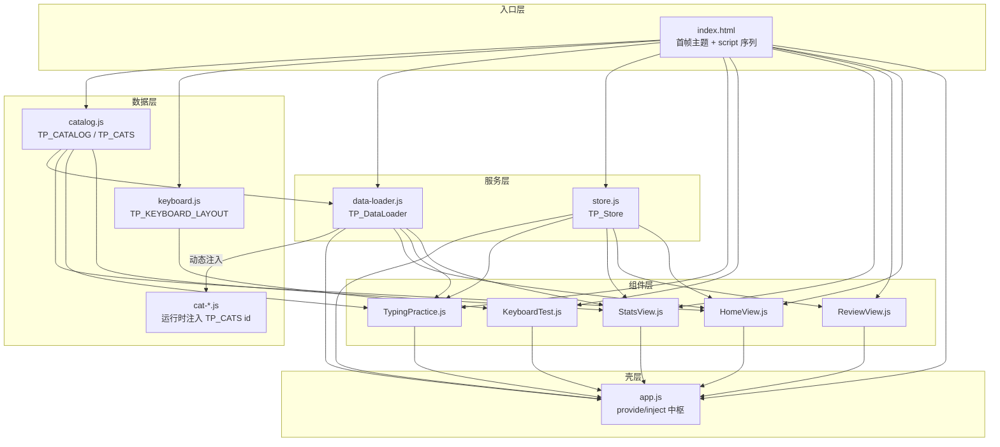
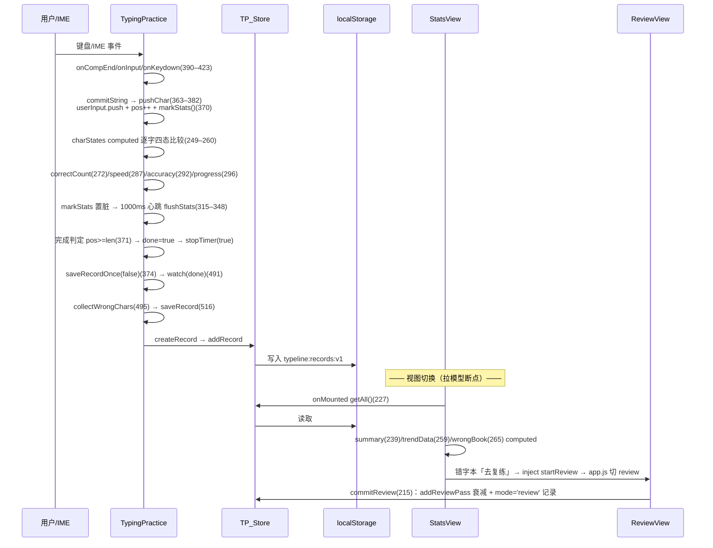

# TypeLine 架构设计文档

**项目：TypeLine** · *One line of text, one line of you*

> 版本：V1 核心 + V2+ 增强（书库/统计/复练/限时/渲染档案）合体  
> 行数口径：编辑器 Read 计数（TypingPractice.js = 782 行；PowerShell `Get-Content` 少计为 727，已校验）  
> 配套文档：`design-doc.md`（V1 产品设计）、`test-cases.md`（测试用例）、`README.md`（使用说明）

---

## 1. 概述

### 1.1 项目定位与技术铁律

纯前端浏览器打字练习 + 键盘全键测试工具，双击 `index.html`（`file://`）即可运行。

| 维度 | 决策（铁律） |
|---|---|
| 框架 | Vue 3 CDN 全局构建 `vue.global.prod.js`（含模板编译器） |
| CDN 版本 | 锁定 `vue@3.5.42`（unpkg 主源 + jsdelivr 回退） |
| 脚本形态 | 经典 `<script>`，**禁止 `type="module"`**（`file://` 下 CORS 限制） |
| 模块共享 | window 全局命名空间，统一 `TP_` 前缀 |
| 构建 | **无**。无 npm/打包器/转译 |
| API 风格 | Composition API + JS 模板字符串 |
| 样式 | 单文件 `style.css`，CSS 变量双主题，禁硬编码色值 |
| 数据读取 | 组件 `setup()` 惰性读取全局数据，规避加载时序 |

铁律收益：零门槛运行、零依赖供应链风险、部署即拷贝。代价与权衡分析见 §9.3。

### 1.2 版本口径澄清

**当前代码 = V1 核心 + V2+ 增强合体。**

| 版本层 | 范围 | 落地状态 |
|---|---|---|
| V1 核心 | 打字练习（逐行配对 + 自适应行切分 + IME）+ 键盘全键测试 + 亮暗主题 + 视图切换 | ✅ 已落地 |
| V2+ 书库与分类 | 五分类注册表 + 按需注入 + 首页选择界面（#33） | ✅ 已落地 |
| V2+ 历史与统计 | localStorage 持久化 + 汇总卡 + SVG 趋势折线 + 历史列表 | ✅ 已落地 |
| V2+ 错字本与复练 | 错字聚合 + 衰减计数 + 独立复练输入链 | ✅ 已落地 |
| V2+ 限时冲刺 | 30/60/120s 限时档 + 告警阈值 | ✅ 已落地 |
| V2+ 渲染档案 profile | 按分类参数化字号/折行/行距三旋钮 | 🔶 **实施中**（#35，见 §4.3） |

`design-doc.md` §2.2/§3.1 中「历史记录与统计」「文章分类/难度分级」「侧边栏目录」曾标注为 V1 明确排除项——该表述已滞后，实际已随 V2+ 全面落地（详见 architecture.md 本节）。侧边栏目录未以侧边栏形态实现，其职能由 HomeView 书库首页承接。

### 1.3 架构健康度结论

**分级：可控技术债（偏健康），非「混乱」。**

一句话定性：**「骨架健康、局部肥胖、契约靠自觉」**

- **骨架健康**：加载顺序（§2.3）、命名空间（§2.4）、单向数据流（§3.2）三条主干契约清晰且被严格遵守；依赖无环；降级处理扎实；数据层扩展点优秀。
- **局部肥胖**：TypingPractice.js（782 行 / 11 类职责）与 style.css（1090 行 / 单文件巨石）两处头重脚轻。
- **契约靠自觉**：JS↔CSS↔DOM 隐式类名契约（C1–C10）无编译期保护，魔法数散落，口径同步靠注释与人肉约定。

---

## 2. 模块与依赖

### 2.1 模块清单与职责表

| 层 | 文件 | 行数 | 单一职责 | 是否越界 |
|---|---|---|---|---|
| 入口 | `index.html` | 42 | 挂载点 + 首帧主题预置 + 有序 script | 否 |
| 数据 | `data/catalog.js` | 51 | 分类注册表 `TP_CATALOG` + 容器 `TP_CATS` 初始化 | 否 |
| 数据 | `data/keyboard.js` | 133 | 104 键布局数组 `TP_KEYBOARD_LAYOUT` | 否 |
| 数据 | `data/cat-{short,long,code,english,poetry}.js` | 113/62/176/63/117 | 各分类正文，挂 `TP_CATS[id]` | 否 |
| 服务 | `data-loader.js` | 57 | 按需动态注入分类 script（pending 去重） | 否 |
| 服务 | `store.js` | 236 | localStorage 记录/偏好/错字本读写与降级 | 否（内聚良好） |
| 组件 | `components/HomeView.js` | 81 | 书库首页卡片网格 + 继续上次 | 否 |
| 组件 | `components/TypingPractice.js` | **782** | 打字引擎+UI+计时+存档+IME锚点+行测量 | **是（严重头重）** |
| 组件 | `components/KeyboardTest.js` | 154 | 键盘测试（keydown 委托 + Map 命中） | 否 |
| 组件 | `components/StatsView.js` | 434 | 汇总卡 + SVG 趋势折线 + 历史列表 + 错字本弹窗 | 偏重（含手绘 SVG 图表引擎） |
| 组件 | `components/ReviewView.js` | 267 | 错字复练（独立轻量输入链） | 否 |
| 壳 | `app.js` | 188 | 根组件：导航/主题/路由/provide 注入 | 否 |
| 样式 | `assets/css/style.css` | **1090** | 全部主题变量+布局+组件样式+断点 | **是（单文件巨石）** |

### 2.2 依赖方向图【图位①：分层依赖有向图】



依赖方向**单向、无环**：`data → service → component → app`。唯一的「运行时反向」是 `data-loader` 动态注入 `cat-*.js`（写 `TP_CATS`），但这是受控懒加载，非静态循环依赖。

### 2.3 加载顺序契约（index.html:22–39）

锁定顺序：

```
Vue CDN(22) → 双源兜底(25–27) → catalog.js(30) → keyboard.js(31) →
data-loader.js(32) → store.js(33) → TypingPractice(34) → KeyboardTest(35) →
StatsView(36) → ReviewView(37) → HomeView(38) → app.js(39)
```

契约要点：
- 经典 script、禁 `type="module"`（index.html:20 注释 + design-doc §4.3）。
- `app.js` 必须最后（依赖全部组件全局）。
- 组件对全局数据一律 **`setup()` 惰性读取**（证据：KeyboardTest.js:63–64、TypingPractice.js:166–176、HomeView.js:51）。
- **契约被严格遵守。**

### 2.4 全局命名空间表（window.TP_*）

| 全局键 | Owner（定义处） | 消费者（引用处） |
|---|---|---|
| `window.Vue` | CDN(index.html:22) | 全部 JS 文件首行 |
| `window.TP_CATALOG` | catalog.js:14 | data-loader.js:12；HomeView.js:51 |
| `window.TP_CATS` | catalog.js:13（init）；cat-*.js（填充） | data-loader.js:21/35/42；TypingPractice.js:170 |
| `window.TP_KEYBOARD_LAYOUT` | keyboard.js:10 | KeyboardTest.js:64 |
| `window.TP_DataLoader` | data-loader.js:52 | app.js:111/154；TypingPractice.js:174；HomeView.js:58；StatsView.js:281 |
| `window.TP_Store` | store.js:217 | app.js:110/157；TypingPractice.js:207/468/517/529；StatsView.js:223/267/381/395；ReviewView.js:232；HomeView.js:56 |
| `window.TP_TypingPractice` | TypingPractice.js:26 | app.js:138 |
| `window.TP_KeyboardTest` | KeyboardTest.js:18 | app.js:133 |
| `window.TP_StatsView` | StatsView.js:36 | app.js:134 |
| `window.TP_ReviewView` | ReviewView.js:18 | app.js:135 |
| `window.TP_HomeView` | HomeView.js:12 | app.js:136/137 |
| `.hbStats` | TypingPractice.js:323 | 仅 headless 自测（生产无消费者） |
| `.measureStats` | TypingPractice.js:647 | 仅 headless 自测（生产无消费者） |

**provide/inject 契约**（app.js:149–171 定义）：

| provide 键 | 定义处 | 消费方 |
|---|---|---|
| `switchTab` | app.js:149 | HomeView(47)、StatsView(218–220) |
| `selectCategory` | app.js:153 | HomeView(47) |
| `goHome` | app.js:164 | TypingPractice(166–167)、StatsView(218–220) |
| `currentCat` | app.js:168 | TypingPractice(166–167) |
| `reviewChars` | app.js:170 | ReviewView(97–98) |
| `startReview` | app.js:171 | StatsView(218–220) |

命名统一 `TP_` 前缀，owner 唯一，**无命名冲突、无重复定义**。命名空间层是健康的。

---

## 3. 状态管理

### 3.1 三层模型

**第一层 · 组件本地 refs（会话态，刷新即失）**

- TypingPractice.js:184–200：`article/pos/userInput/startTime/elapsed/done/isComposing/composingText/lineStarts` + 非响应式 `timerId/rowEls/resetting/measuredKey/measuredWidth`。
- KeyboardTest.js:69–71：`testedKeys(reactive Set)/pressedCode/pressTimer`。
- StatsView.js:223–224/270：`records/confirmClear/wbOpen`。
- ReviewView.js:100–107：`pos/userInput/done/…`。

**第二层 · TP_Store（应用状态服务，store.js）**

- 记录：`createRecord(63)/addRecord(80)/removeRecord(89)/clearAll(95)/getAll(100)`。
- 错字本：`aggregateWrongChars(113)/getWrongBook(168)/addReviewPass(154)`。
- 偏好：`getPrefs(200)/setPrefs(210)/normPrefs(187)`。
- Store **无响应式、无事件**：StatsView 靠 `onMounted` 主动 `getAll()` 拉取（StatsView.js:227–231），写后靠 `refreshRecords()` 手动重读（376–378）。**拉模型（pull）**，非订阅模型。

**第三层 · localStorage 键表**

| 键 | Owner | 结构 | 版本策略 | 证据 |
|---|---|---|---|---|
| `tp_theme` | index.html + app.js | `"dark"\|"light"` | V1 遗留，不改名不迁移 | index.html:12；app.js:24/28/35 |
| `typeline:records:v1` | store.js | 记录数组，环形 MAX=500 | 末尾 v1，schema 变更升版+迁移 | store.js:13/14/83 |
| `typeline:review:decay:v1` | store.js | `{[char]:number}` 复练衰减计数 | 同上 | store.js:17 |
| `typeline:prefs:v1` | store.js | `{mode,timedSec,…}` 未知字段透传 | 同上 | store.js:21/22/193–196 |

### 3.2 数据流链路【图位②：端到端数据流泳道图】



**口径一致性风险点**：记录的 `chars/durationMs/cpm/accuracy` 口径在 store.js:52–61 注释与 TypingPractice computed 之间靠「人肉约定」对齐（隐式契约 C7）。`mode='review'` 隔离过滤在 store.js:169 与 StatsView.js:240/260 **三处重复硬编码**（C8）。

### 3.3 降级策略

- **全部读写包 try/catch 静默降级**（store.js:29–48/142–152/200–214；app.js:26–37）。
- localStorage 禁用/超额/非法 JSON → 返回空数组/空对象，不抛错、不阻塞渲染。
- schema 版本键（末尾 `v1`）：破坏性变更时升版并写迁移逻辑（design-doc §14）。
- **降级策略是本项目最扎实的一环。**

---

## 4. 渲染管线

### 4.1 现行管线【图位③：渲染管线数据流图】

```
┌──────────────────────────────────────────────────────────────────────────┐
│                         渲染管线（TypingPractice.js）                      │
├──────────────────────────────────────────────────────────────────────────┤
│                                                                          │
│  ┌─────────────┐    ┌──────────┐    ┌──────┐    ┌──────────┐           │
│  │ mirror 测量  │───►│lineStarts│───►│ rows │───►│ 行渲染    │           │
│  │ (636–687)   │    │  (ref)   │    │(comp)│    │(template │           │
│  └──────┬──────┘    └──────────┘    └──────┘    │ 62–100)  │           │
│         │                                        └─────┬────┘           │
│         │ 隐藏 .row-mirror                              │                │
│         │ 逐字符 span.ch-slot                           ▼                │
│         │ getBoundingClientRect().top         ┌─────────────────┐       │
│         │ top 变化 → 行首(674–680)            │ IME 锚点/光标/   │       │
│         │                                    │ 组合预览(539–567)│       │
│         │ 增量去重：key=id:码点数             └─────────────────┘       │
│         │ + measuredWidth 命中→skip(666–669)                             │
│                                                                          │
│  ┌─────────────────────────────────────────────┐                        │
│  │ 重算触发(689–724)：                          │                        │
│  │ ResizeObserver + resize + matchMedia(768px) │                        │
│  │ + fonts.ready → debounce 120ms(692)         │                        │
│  └─────────────────────────────────────────────┘                        │
└──────────────────────────────────────────────────────────────────────────┘
```

管线五步骤：

1. **mirror 测量**（636–687）：隐藏 `.row-mirror` 逐字符 `<span class="ch-slot">`（template:30–34），JS 设宽 = `.row-source` 内容区宽（661），遍历 span `getBoundingClientRect().top`，top 变化处记为行首（674–680）→ `lineStarts`。增量去重：`key=id:码点数` + `measuredWidth` 命中则 skip（666–669）。
2. **lineStarts → rows**（219–235）：由行首全局索引派生 `{chars,start,end}`；首测前种子单行（227）。
3. **行渲染**（template:62–100）：每 `.row` 上=原文四态 `.char`（71–76），下=配对输入行 `.row-input`（77–99）；`activeRowIndex`=「包含 pos 的行」查找（238–246）。
4. **IME 锚点/光标/组合预览**（539–567）：`updateCaretAnchor` 用 `.in-char` 末个 rect.right（组合期取 `.composing` rect.right）算 left，clamp `[0, clientWidth-240]`；隐藏 input 锚到输入行底边；`.caret` 与锚点同源 left（565–566）。触发：watch activeRowIndex(611)/pos(621)/composingText(629)，均 nextTick + rAF 双保险。
5. **重算触发**（689–724）：ResizeObserver + resize + matchMedia(768px) + fonts.ready，统一 debounce 120ms（692）。

### 4.2 IME 锚点与同源契约

锚点几何核心约束：

- **C1（JS↔CSS 类名契约）**：`querySelector` 硬编码 `.row-input/.in-char/.composing/.caret/.row-source`（TypingPractice.js:545/547/551/565/657 ↔ style.css:342/385/418/392/336）。改类名 = 静默破坏，无编译期保护。
- **C2（测量↔渲染排版同源）**：`.row-mirror` 与 `.row-source` **必须共享** `.line-text`（font/line-height/word-break/white-space），否则 lineStarts 失配（TypingPractice.js:30/637 ↔ style.css:248–256/336–340）。此为 design-doc §8.7 反复强调的历史坑。

### 4.3 渲染档案 profile 三旋钮（#35 · 实施中）

> **状态：实施中，代码尚无落地。** 全仓 grep `profile/档案/renderProfile` 零命中；catalog.js 分类项当前字段仅 `{id,name,desc,file,count}`（catalog.js:15–49），无 profile 字段；TypingPractice 渲染路径为单一硬编码，无按分类分支。

设计口径——「三旋钮」为在 `catalog.js` 每分类挂 `profile` 对象，由 TypingPractice 读取以参数化当前被写死的三个渲染维度：

| 旋钮 | 现行硬编码证据 | profile 化后按分类差异（设计意图） |
|---|---|---|
| **① 字号 / 字符槽宽** | `.row-source/.row-mirror` 19px、`.row-input` 17px（style.css:338/343）、`--ch-w:19px`（style.css:35）；断点降为 17/15/`--ch-w:17px`（731–733） | code/english（latin）与 CJK 字形度量不同，需独立槽宽/字号档 |
| **② 换行策略** | `.line-text` `word-break:break-all; white-space:pre-wrap`（style.css:254–255）——逐字符折行 | english/code 应按**词边界**折行（否则单词被腰斩），诗文/中文按字折行 |
| **③ 行距 / 对齐密度** | `.line-text line-height:1.7`（style.css:253）、`.row` padding（style.css:315） | 长文 vs 短文 vs 代码的行密度/内边距档位 |

**⚠️ 测量同源契约 C2 注意事项**：三旋钮值必须同时作用于 **mirror 与 .row-source**——若 profile 只改 `.row-source` 的 font-size/word-break 而未同步 `.row-mirror`，测量与渲染排版不同源，lineStarts 将失配，这是 design-doc §8.7 列为历史坑的严重回归。落地时建议配 headless 回归验证。

---

## 5. 样式组织

### 5.1 style.css 分区地图（1090 行）

| 行段 | 职责 | 备注 |
|---|---|---|
| 1–65 | 主题变量面：`:root`(亮) + `[data-theme="dark"]`(暗) | 26 个变量/主题，颜色全变量化（禁硬编码，行 4 声明） |
| 67–97 | 全局重置 + 满屏弹性壳 `.app`(100dvh flex 列) | #28 布局基座 |
| 99–201 | 顶部栏 `.app-bar/.brand/.tabs/.theme-btn` + 主区 `.app-main` | 含 #29 回归补丁(195–201) |
| 203–237 | 按钮层级 `.btn{ghost/primary/outline}` | 复用体系 |
| 239–507 | **打字视图**：`.tp/.line-text/.row-mirror/.rows/.row/.char 四态/.row-input/.caret/.composing/.hidden-input/.pos-indicator/.hud/.pill` | 核心区，含测量同源契约(248–256) |
| 509–589 | 完成弹窗 `.modal-*` | |
| 591–761 | 键盘视图 `.kb-*/.ring-*/.key{pressed,tested}` + `.boot-error` + **768 断点①**(726–752) + `.kb-note` | `.kb-grid` 91 列 min-width 860(665–670) |
| 763–930 | 统计视图 `.stats-*/.stat-card/.trend-svg/.svg-*/.list-row/.tag-*` + **768 断点②**(920–930) | 独立新增块 |
| 932–1017 | F3 工具条 `.tp-toolbar/.seg/.pill.warn/.tp-toast` + 错字本 `.wb-*` + 复练 `.review-*` + **768 断点③**(1012–1017) | |
| 1019–1069 | 书库首页 `.home-*/.cat-chip` + **768 断点④**(1065–1069) | |
| 1071–1090 | 内容列宽分档 #31：`@media(min-width:1537px/1920px)` | 尾部覆盖 `.row`(源码序胜出) |

### 5.2 主题变量面与断点体系

**主题变量面**：26 变量（bg/card-bg/text/text-secondary/accent/correct/wrong/cursor + 派生 bar-bg/on-accent/tab-bg/track/border/mask/accent-glow/key-* 7 项/shadow-* 2 项 + `--ch-w`）。亮暗 `accent/correct/wrong/cursor` **同值**（16/47），四态色跨主题一致（design-doc §8.1/8.2 契约）。

**断点**：`768px` 出现 **4 次**（726/920/1012/1065），`min-width:1537px`(1076)、`1920px`(1079)。同一断点分散 4 处是重复组织 smell。

### 5.3 已知重复/冲突规则清单

| # | 问题 | 位置 | 严重度 |
|---|---|---|---|
| 1 | `.row-input` **定义两次**：靠级联合并，阅读割裂、易漏改 | style.css:342 + 375 | 中 |
| 2 | `@media(max-width:768px)` **4 段分散**：窄屏调整需跨 300+ 行拼凑 | 726/920/1012/1065 | 中 |
| 3 | `.row` 被**三处**定义：靠源码序覆盖，尾部覆盖依赖「必须放最后」隐式约定 | 311/738/1083 | 中 |
| 4 | `rgba(255,69,58,0.10)` 危险态硬编码色重复两处，未走 `--wrong` 变量 | 872/917 | 低 |
| 5 | `rgba(48,209,88,…)`/`rgba(10,132,255,…)` 在 `.tag-*` 硬编码，与 `--correct/--accent` 语义重复 | 903/907/994/1001 | 低 |

---

## 6. 键盘测试模块

数据驱动布局 + code→key Map + preventDefault 裁决：

- **数据源**：`window.TP_KEYBOARD_LAYOUT`（keyboard.js，133 行，104 键 `{r,c,w,rs,label,code}`）。
- **映射**：组件初始化时遍历布局数组构建 `Map<code, 键定义>`（KeyboardTest.js:63–64），keydown 事件 O(1) 命中。
- **状态**：`testedKeys`（reactive Set），持久高亮已测键；进度 computed = `testedKeys.size`/104。
- **生命周期**：`document` 级 keydown 在 `onMounted` 添加、`onUnmounted` 移除——仅键盘视图激活时生效。
- **preventDefault**：对 Tab/空格/方向键拦截防滚动与焦点跳移；**放行 F5/F12**；事件源自 `.app-bar` 时放行 Tab/空格（裁决4，C9 隐式耦合：依赖 `closest(".app-bar")` ↔ app.js:55 模板类名）。
- **CSS 耦合 C6**：`.kb-grid` `repeat(91,…)` 列数须匹配 keyboard.js 中 `c/w` 坐标域（style.css:667 ↔ keyboard.js:127）。

---

## 7. 数据层

### 7.1 catalog 注册表（catalog.js，51 行）

```js
window.TP_CATS = window.TP_CATS || {};
window.TP_CATALOG = [
  { id:"short",   name:"短文",       desc:"…", file:"cat-short.js",   count:20 },
  { id:"long",    name:"长文",       desc:"…", file:"cat-long.js",    count:10 },
  { id:"code",    name:"程序预存字", desc:"…", file:"cat-code.js",    count:32 },
  { id:"english", name:"英文选段",   desc:"…", file:"cat-english.js", count:10 },
  { id:"poetry",  name:"古诗文名句", desc:"…", file:"cat-poetry.js",  count:20 }
];
```

字段：`id`（分类唯一键）、`name`（显示名）、`desc`（卡片描述）、`file`（数据文件名）、`count`（篇数）。

### 7.2 cat-*.js 正文 schema

```js
window.TP_CATS.short = {
  id:"short", name:"短文",
  articles:[ { id:1, title:"…", text:"…" } /* count 篇 */ ]
};
```

- id 全分类唯一：短文 1–20 / 长文 21–30 / 程序预存字 101–132 / 英文 201–210 / 诗文 301–320。
- 程序预存字为纯单词列表（空格分隔，字符集 `[A-Za-z0-9_ ]`）。
- 诗文不用字面 `\n`，视觉换行由自适应行切分处理。

### 7.3 data-loader 按需注入（data-loader.js，57 行）

`ensureCategory(id, cb)` 流程：
1. `TP_CATS[id]` 已载 → 同步 `cb(null, entry)`。
2. 未载 → 查 `TP_CATALOG` 得 `file` → `createElement('script')` 注入 `assets/js/data/<file>`。
3. `onload`（校验挂载）→ `cb(null, TP_CATS[id])`；`onerror`（移除节点允许重试）→ `cb(err)`。
4. 同 id 并发经 `pending` Map 排队共享一次注入。

### 7.4 keyboard 布局数据（keyboard.js，133 行）

104 键，每键 `{r,c,w,rs,label,code}`；`r`=grid 行、`c`=grid 列、`w`=跨列宽度、`rs`=区段标记、`code`=KeyboardEvent.code。由 KeyboardTest 遍历构建 Map（见 §6）。

---

## 8. 技术债与混乱度评估

### 8.1 职责过载文件 TOP3

| 排名 | 文件 | 行数 | 承担职责列举 | 严重度 |
|---|---|---|---|---|
| 1 | **TypingPractice.js** | 782 | ①文章池/抽篇(16–22,184,447) ②行测量引擎(636–693) ③四态比较(249–260) ④计时+心跳(315–360) ⑤IME 组合链(386–423) ⑥锚点/光标几何(539–567) ⑦自动滚动(588–608) ⑧偏好/限时(205–209,302–313,459–479) ⑨存档+错字收集(481–530) ⑩toast(460–466) ⑪生命周期/清理(702–739) | **高** |
| 2 | **style.css** | 1090 | 全部主题变量+全局布局+5 视图组件样式+4 段断点+尾部宽度分档，单文件 | **中高** |
| 3 | **StatsView.js** | 434 | 汇总(239)+**手绘 SVG 图表引擎**(15–17,288–367 坐标换算/轴/网格/折线/端点)+历史列表(370–399)+错字本弹窗(264–274)+二次确认清空(386–399) | **中** |

**头重脚轻分析**：TypingPractice 单组件 782 行、11 类职责、`setup()` 返回 33 个成员（741–778）。测量引擎（636–693）、锚点几何（539–567）、计时心跳（315–360）、存档（481–530）四块本可独立。对比健康样例：KeyboardTest(154)/HomeView(81)/ReviewView(267) 职责单一、行数可控——证明团队有能力写内聚组件，TypingPractice 是历史累积（V1 引擎 + #12/#15/#20/#26/#28/#32/#33/F3/F4 多轮叠加）。

### 8.2 魔法数清单

| 值 | 含义 | 位置 | 严重度 |
|---|---|---|---|
| `20` | 放弃存档字数阈值 | TypingPractice.js:446/727 | **高**（两处重复，改一漏一） |
| `240` | 锚点 left clamp 余量 | TypingPractice.js:557 | 中（无注释来源） |
| `120` | 测量 debounce ms | TypingPractice.js:692 | 中 |
| `550` | 动画后锚点校正延时 | TypingPractice.js:712 | 中（耦合 CSS tp-rise） |
| `120` | 平滑滚动兜底延时 | TypingPractice.js:605 | 低 |
| `1000` | 心跳间隔 ms | TypingPractice.js:347 | 低 |
| `2200/3000` | toast/清空确认 ms | TypingPractice.js:465；StatsView.js:392 | 低 |
| `10000` | 限时告警阈值 | TypingPractice.js:127 | 低 |
| `30/60/120` | 限时档（三处） | TypingPractice.js:46–48/304；store.js:190 | 中（三处需同步） |
| `500` | 记录环形上限 | store.js:14 | 低（已具名 MAX） |
| `±3/+4`(7字) | 错字上下文窗口 | TypingPractice.js:502–503；store.js:61/111 | 中（口径靠注释同步） |
| `24` | 复练行固定切片 | ReviewView.js:16 | 低（已具名 ROW_SIZE） |
| `min(count,3)` | 错字重复次数 | ReviewView.js:118 | 低 |
| `34/2πR` | 环形进度半径 | KeyboardTest.js:15–16 | 低（已具名） |
| `640/180/44/596/14/156` | SVG 坐标系 6 常量 | StatsView.js:16–17 | 低（已具名 CW/CH/CL…） |
| `1.15` | 速度轴余量系数 | StatsView.js:314 | 低 |
| `91/860/720/52` | 键盘网格列数/最小宽/行高 | style.css:667/669/747/668 | 中（与 keyboard.js 强耦合 C6） |
| `19/17px`,`--ch-w:19px` | 字号/槽宽 | style.css:35/338/343 | 中（三处必须同源，profile 化前是硬约束） |

**观察**：具名常量做得较好（store/KeyboardTest/StatsView/ReviewView 多数已具名）；问题集中在 TypingPractice.js——`20`、`240`、`550`、`120` 等直接内联且部分两处重复。

### 8.3 隐式耦合清单（C1–C10）

| # | 耦合 | 证据 | 严重度 |
|---|---|---|---|
| C1 | **JS↔CSS 类名契约**：JS `querySelector` 硬编码类名 `.row-input/.in-char/.composing/.caret/.row-source` | TypingPractice.js:545/547/551/565/657 ↔ style.css:342/385/418/392/336 | **高** |
| C2 | **测量↔渲染排版同源**：`.row-mirror` 与 `.row-source` 必须共享 `.line-text` | TypingPractice.js:30/637 ↔ style.css:248–256/336–340 | **高** |
| C3 | **DOM 结构假设**：mirror span 数必须 === 码点数，否则保留旧 rows | TypingPractice.js:654 | 中 |
| C4 | **动画↔JS 时序**：`550ms` 耦合 CSS `tp-rise 0.4s + delay(--i*40ms)` | TypingPractice.js:712 ↔ style.css:319–320 | 中 |
| C5 | **data-theme 三方契约**：index.html 首帧内联 / app.js watch / CSS 选择器 | index.html:13 ↔ app.js:121 ↔ style.css:38 | 中 |
| C6 | **键盘网格 CSS↔数据**：CSS `repeat(91,…)` 须匹配 keyboard.js `c/w` 坐标域 | style.css:667 ↔ keyboard.js:127 | 中 |
| C7 | **记录口径注释契约**：store `createRecord` 口径靠注释与 TypingPractice computed 对齐 | store.js:52–61 ↔ TypingPractice.js:287–295 | 中 |
| C8 | **mode='review' 隔离**：过滤字符串三处硬编码 | store.js:169；StatsView.js:240/260 | 中 |
| C9 | **app-bar 头部例外**：KeyboardTest `closest(".app-bar")` 依赖 app.js 模板类名 | KeyboardTest.js:117 ↔ app.js:55 | 低 |
| C10 | **组件全局名 ↔ currentTabComp 映射**：字符串 tab → window.TP_* | app.js:132–139 | 低 |

### 8.4 headless 自测约定评价

**机制**：观测计数器挂到组件定义对象——`window.TP_TypingPractice.hbStats`(323)、`.measureStats`(647)，供外部 headless 脚本读取心跳 ticks/flushes/marks（324/330/343）与测量 full/skip/ms（667/684–685）。

**优点**：零依赖下提供可观测性，无需测试框架即可断言性能优化是否生效；符合 file:// 铁律。

**缺点/风险**：
1. 测试态泄漏进生产全局命名空间（两个键永挂 window，生产无用）。
2. 挂在组件定义对象（非实例），模块级单例，多次挂载/热切换共享同一计数器，观测值语义模糊。
3. 无自动化断言，纯人工读值，属「临时 harness」而非可持续测试。

严重度：**中**（可维护性债务，非结构性危险）。改造建议见路线图 S5。

---

## 9. 可扩展性评估

### 9.1 扩展点矩阵

| 扩展场景 | 步骤 | 触碰文件数 | 评价 |
|---|---|---|---|
| **加一个分类** | ①catalog.js 加注册项 ②新建 cat-xxx.js 挂 TP_CATS[id] | **2** | 优。data-loader 自动按需注入，HomeView/StatsView 自动显示，零组件改动 |
| **加一个视图（Tab）** | ①新建组件挂 window.TP_Xxx ②app.js currentTabComp 加分支(132–139) ③app.js 加 tab 按钮(60–85) ④index.html 加 script | **3** | 良。StatsView/ReviewView 即此路径加入 |
| **加一个存储键** | ①store.js 加 KEY + read/write（沿用 typeline: 前缀 + v 后缀 + try/catch 降级） | **1** | 优。normPrefs 未知字段透传(193–196)免改偏好结构 |
| **加一个主题** | ①style.css 加 `[data-theme="x"]` 变量块 ②app.js toggleTheme 改多值(126–128) ③readTheme/writeTheme 校验(26–37) | **2** | 中。当前 dark/light 二元硬编码，加第三主题需改判定逻辑 |
| **加渲染档案 profile（#35）** | ①catalog.js 每项加 profile ②TypingPractice 读 profile 参数化 ③style.css 变量化三旋钮 ④mirror 与 row-source 同步 | **3–4** | **待落地**。触及测量同源契约(C2)，风险中高 |

### 9.2 缺口影响

| 缺口 | 对扩展的实际影响 |
|---|---|
| **无模块化（window 全局）** | 加数据/组件影响小；但跨文件重构无编译期保护——C1/C7/C8 类隐式契约改名即静默崩坏，只能靠人工全仓 grep |
| **无构建** | 无法用 TS/Sass/组件拆分打包；style.css 只能单文件，TypingPractice 不能拆 SFC。**这是头重的根因** |
| **无类型** | 记录 schema、profile 结构、provide/inject 契约全靠注释维系；V2+ 字段扩展易出现 undefined 读取 |
| **无单测（仅临时 harness）** | 测量引擎/锚点几何/统计口径等高风险纯逻辑无回归网；每次打补丁靠 headless 截图人工验证 |

### 9.3 file:// 铁律权衡分析

铁律（design-doc §1.2/§9.8）：经典 script、禁 type=module、无构建、双击直跑、CDN 引入 Vue。

- **收益**：零门槛运行、零依赖供应链风险、部署即拷贝——对「打字练习」这类工具型应用完全够用。
- **代价**：牺牲模块化/类型/单测/样式拆分能力，直接导致 TypingPractice 与 style.css 无法自然分解，隐式契约无法被工具守护。
- **权衡结论**：铁律与当前规模（约 2600 行 JS + 1090 行 CSS）**尚在兼容区间**；但已逼近临界——若继续叠加 V2+ 功能（难度分级、导出导入 F9、更多分类），头重文件与隐式契约的维护成本将**超线性增长**。可在不破坏 `file://` 双击的前提下引入「轻构建」（见路线图 S4）作为泄压阀。

---

## 10. 重构路线图

### 10.1 快赢 Q1–Q7（≤1 批次，不破坏铁律，低风险）

| # | 项 | 收益 | 风险 | 触碰面 |
|---|---|---|---|---|
| Q1 | **魔法数收常量**：TypingPractice 的 `20/240/550/120/1000/2200` 提为文件顶部具名 const（尤其 `20` 两处 446/727 合一） | 消除「改一漏一」，语义自解释 | 极低（等价替换） | TypingPractice.js 单文件 |
| Q2 | **style.css 分区注释化**：补统一 `/* === 区块 N === */` 目录头 + 合并 4 段 768 断点为一段（或加锚点注释） | 降低巨石认知负荷 | 低（断点合并需回归窄屏） | style.css |
| Q3 | **`.row-input` 双定义合并**（style.css:342+375）、`.row` 三处覆盖加交叉注释 | 消除级联割裂 | 低 | style.css |
| Q4 | **硬编码色收敛**：`rgba(255,69,58,…)`(872/917) 等改引 `--wrong` 派生变量 | 兑现「禁硬编码」自我声明 | 低 | style.css |
| Q5 | **mode='review' 常量化**：三处字符串(C8)提为 store 导出常量 | 消除分散魔法字符串 | 低 | store.js + StatsView.js |
| Q6 | **TypingPractice 拆 composables 候选边界标注**：以注释圈定 `useLineMeasure`(636–693)/`useCaretAnchor`(539–567)/`useSessionTimer`(315–360)/`useRecord`(481–530) 四块边界 | 明确后续拆分线，零行为变更 | 极低 | TypingPractice.js |
| Q7 | **文档口径对齐**：design-doc §2.2/§3.1 更新为「V2+ 已落地」，与 README/代码一致 | 消除版本漂移误导 | 极低 | design-doc.md |

### 10.2 结构级 S1–S5（需权衡 file:// 铁律，中高风险）

| # | 项 | 收益 | 风险 | 触碰面 | 铁律权衡 |
|---|---|---|---|---|---|
| S1 | **TypingPractice 拆多文件**：按 Q6 四边界拆为 `engine/measure.js`、`engine/caret.js`、`engine/timer.js` + 瘦组件，经 window.TP_* 子命名空间共享 | 782→约 300 行主组件，职责单一 | **中**：须保测量同源(C2)/锚点时序(C4)；无构建下只能多 script 全局共享 | TypingPractice.js + index.html script 序 | **兼容** |
| S2 | **store 事件化（拉→推）**：TP_Store 增 `subscribe(cb)`，写记录后广播；StatsView 订阅替代 onMounted 手动 getAll | 消除拉模型断点，多视图数据实时一致 | 中：需管理订阅生命周期防泄漏 | store.js + StatsView.js + ReviewView.js | 兼容 |
| S3 | **渲染档案 profile 落地（#35）**：catalog 加 profile 字段 + 三旋钮参数化（§4.3） | 修复 english/code `break-all` 腰斩单词；为分类差异化渲染铺路 | **中高**：触及测量同源契约，须 mirror/row-source 同步；建议配 headless 回归 | catalog.js + TypingPractice.js + style.css | 兼容（数据驱动） |
| S4 | **引入「轻构建」泄压（可选，破坏铁律）**：源码用 ESM/Sass/TS 编写，构建产出单一 bundle.js + bundle.css，产物仍双击直跑 | 恢复模块化/类型/样式拆分能力，根治头重 | **高**：引入 npm/构建链，违背「零构建双击」原始决策 | 全仓 + 新增构建配置 | **冲突**：当前规模不建议 |
| S5 | **headless harness 正式化**：将 hbStats/measureStats 从组件定义对象移到独立 `window.TP_Diag` 命名空间，加开关（生产不挂） | 消除测试态污染生产全局 | 低中 | TypingPractice.js + 新增 diag 约定 | 兼容 |

**优先级建议**：Q1–Q7 立即做（一批次内，纯降债无行为变更）→ S1+S2（结构级第一优先，直击「无法维护」痛点）→ S3（配合 #35 并行任务）→ S5 → S4 仅在 V2+ 全面铺开、规模突破临界时作为战略选项评估。

---

## 附录 A. 关键决策与裁决索引

引自 design-doc §13（修订记录/最终决策），与架构直接相关的裁决：

| 裁决 | 结论 | 架构影响 |
|---|---|---|
| 裁决1 | `<component :is>` 无 `<keep-alive>`，切走切回状态重置 | 组件生命周期即状态管理边界 |
| 裁决2 | 104 标准键全部可经 `e.code` 捕获，无保留标注 | KeyboardTest 数据驱动、无特殊分支 |
| 裁决3 | 进度/速度/准确率含除零守卫 | computed 内防御性编程 |
| 裁决4 | 键盘视图 preventDefault 规则 + `.app-bar` 头部例外 | C9 隐式耦合来源 |
| 裁决5 | 768px 断点 + word-break 优雅换行 | style.css 断点体系 |
| 裁决6 | 退格回起点重显提示文案 | 状态归零逻辑 |
| **裁决7** | 行切分改为基于浏览器自然换行检测的自适应方案 | 渲染管线（§4.1）核心设计决策 |

---

## 附录 B. localStorage 键与记录 schema 契约

### B.1 键总览

| 键 | 版本 | Owner | 用途 |
|---|---|---|---|
| `tp_theme` | V1 遗留 | index.html + app.js | 主题偏好 `"dark"\|"light"`，不改名不迁移 |
| `typeline:records:v1` | V2 | store.js | 练习历史记录 JSON 数组（环形 MAX=500） |
| `typeline:review:decay:v1` | V2 | store.js | 错字复练衰减计数 `{[char]:number}` |
| `typeline:prefs:v1` | V2 | store.js | 用户偏好 `{mode,timedSec,cat,…}`，未知字段透传 |

### B.2 记录 schema（store.js:63–77）

```js
{
  id: Number,         // 时间戳唯一 ID
  ts: Number,         // Date.now() 创建时间
  articleId: Number,  // 文章 id
  chars: Number,      // 全文字符数
  durationMs: Number, // 用时毫秒
  cpm: Number,        // 速度（字/分钟）= correctCount / (durationMs/60000)
  accuracy: Number,   // 准确率 % = correctCount / pos * 100
  wrongChars: Array,  // 错字上下文 [{char, ctx, idx}]
  mode: String,       // 'normal' | 'timed' | 'review'
  cat: String,        // 分类 id（#33 新增），旧记录无此字段→显示「历史」
  abandoned: Boolean  // 是否中途放弃（≥20 字才存档）
}
```

### B.3 降级规则

- 键不存在（首次使用）→ 返回空数组/空对象。
- 值为非法 JSON → 静默降级。
- 解析结果类型不符 → 静默降级。
- 数组内元素缺少 `id` 字段 → 过滤跳过。
- 全部 try/catch 包裹，绝不向调用方抛错。

### B.4 schema 演进规范（design-doc §14）

- V2 新键统一 `typeline:` 前缀。
- 末尾版本号（`v1`）：破坏性变更时升版（如 `typeline:records:v2`）并在 `read()` 内写向前迁移逻辑。
- 旧版本键数据保留过渡期后再清理。

---

## 附录 C. 图表位清单

| 图位 | 位置 | 类型 | 说明 |
|---|---|---|---|
| **①分层依赖有向图** | §2.2 | mermaid graph TD | data→service→component→app 四层有向图 |
| **②端到端数据流泳道图** | §3.2 | mermaid sequenceDiagram | 输入→比较→统计→存档→统计视图→复练 全链路 |
| **③渲染管线图** | §4.1 | ASCII 框图 | mirror测量→lineStarts→rows→行渲染→IME锚点 |

可选补充图位（暂未落地）：
- provide/inject 关系图（app.js 与五组件间的注入/消费拓扑）
- profile 三旋钮作用域图（catalog→TypingPractice→style.css→mirror 的参数传递）

---

*文档结束 · TypeLine 架构设计文档 · 基于看板 #36 全量审计落地*

