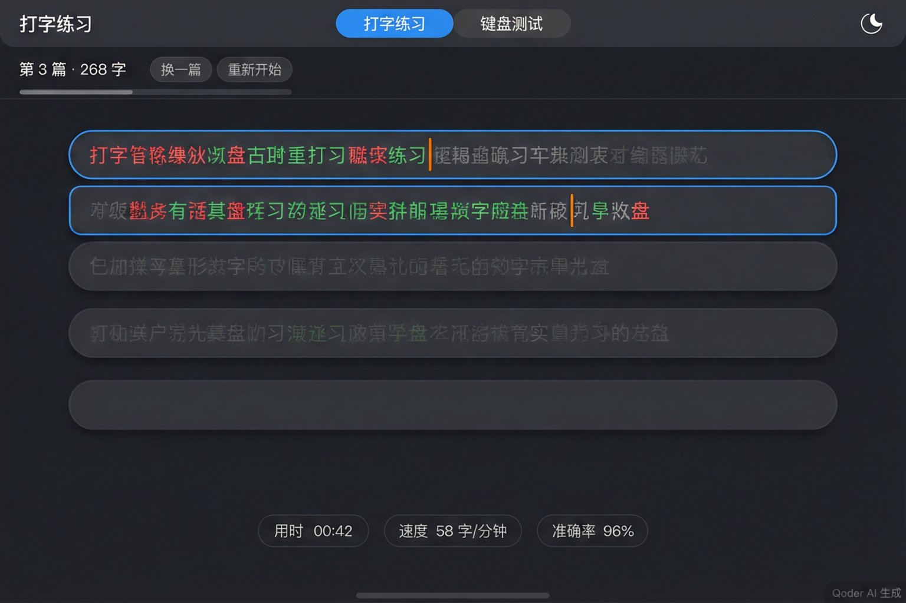
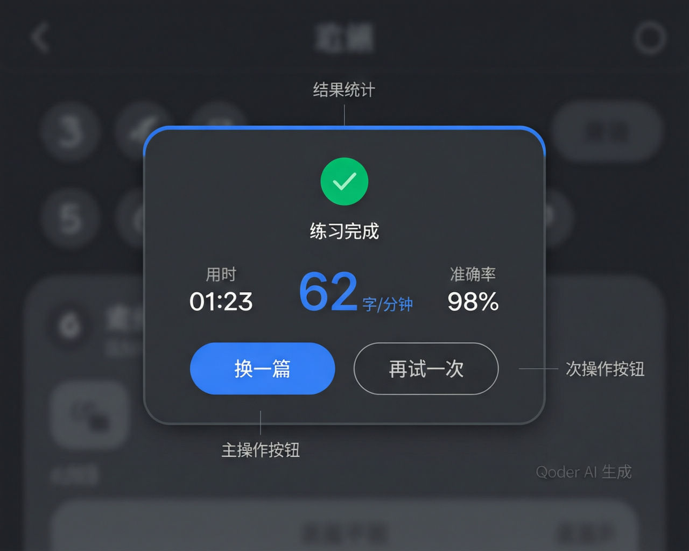
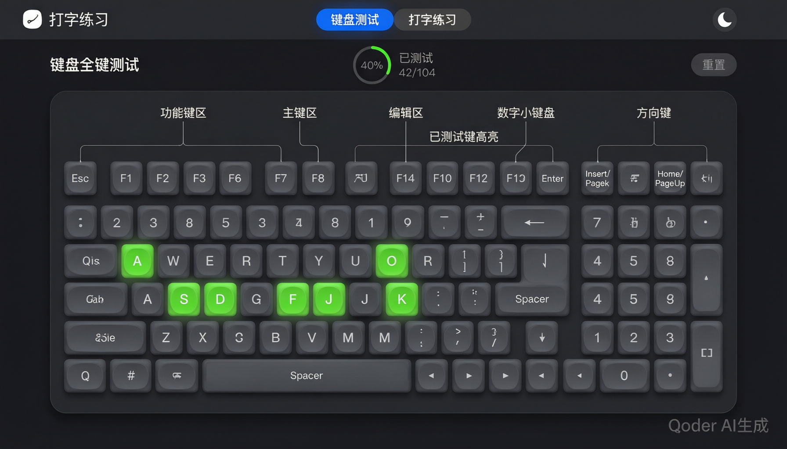

# 打字练习 + 键盘全键测试网页 · V1 详细产品设计文档

**项目英文名：TypeLine** · 品牌语：*One line of text, one line of you*

> 角色：项目经理（PM） · 版本：V1（版本迭代第一版，仅核心功能）
> 技术方向：**Vue 3（CDN 全局构建）+ 多文件 + 纯 HTML 无构建步骤**（已与用户确认）
> 本文档定位：**decision-complete**（决策完整），前端与测试可直接依据本文档实现与验收，无需二次澄清。
> 重要声明：本项目**完全重新设计**，严禁参考或复用任何既有旧文件的代码 / 结构 / 行号。所有关键技术正确性设计均从第一性原理出发（见第 9 章）。

---

## 1. 项目概述与目标

### 1.1 项目定位
一个**浏览器端可直接运行的纯 HTML 应用**（基于 Vue 3），提供两大核心能力：
1. **中文打字练习**：随机加载中文日常文章，逐字对比输入，实时统计用时/速度/准确率，兼容中文输入法（IME）。
2. **键盘全键测试**：104 键标准键盘布局可视化，按过的键持久高亮，实时统计测试进度。

同时提供**亮暗主题切换**（记住偏好）与**打字/键盘视图切换**。

### 1.2 技术栈（已确认，决策锁定）
| 维度 | 决策 |
| --- | --- |
| 框架 | **Vue 3**，CDN 引入全局构建 |
| Vue 构建版本 | **必须用含模板编译器的完整全局构建** `vue.global.prod.js`（**不是** runtime-only 的 `vue.runtime.global.js`），否则运行时 `template: '...'` 字符串无法编译 |
| CDN 版本 | **锁定 `vue@3.5.42`**（回归验证通过的确定版本，禁用 `vue@3` 浮动标签以保证可复现） |
| CDN 源 | **主源 unpkg**：`https://unpkg.com/vue@3.5.42/dist/vue.global.prod.js`；**回退 jsdelivr**：`https://cdn.jsdelivr.net/npm/vue@3.5.42/dist/vue.global.prod.js`。主源 `<script onerror>` 时同步加载回退源，两源均指向 `dist/vue.global.prod.js`（含模板编译器） |
| 联网 | 用户确认可联网，离线非必须 |
| 构建步骤 | **无**。纯 HTML + 经典 `<script>`，双击 `index.html` 直接运行 |
| 脚本类型 | **经典 `<script>`，禁止 `type="module"`**（`file://` 下 ES 模块受 CORS 限制，无法双击打开） |
| 模块共享 | 多 JS 文件通过挂载 **window 全局命名空间** 共享（如 `window.TP_CATALOG`/`window.TP_CATS`（#33 书库，原 `window.TP_ARTICLES` 已废）、`window.TP_TypingPractice`） |
| API 风格 | **Composition API**（从全局 `Vue` 解构 `createApp/ref/reactive/computed/watch/onMounted/onUnmounted`） |
| 模板方式 | 组件模板一律用 **JS 模板字符串**（`template: \`...\``）；`index.html` 只放 `<div id="app"></div>`，规避 in-DOM 模板的大小写不敏感与表格解析陷阱 |

### 1.3 核心目标（可量化）
| 目标 | 度量 |
| --- | --- |
| 联网双击运行 | 联网下双击 `index.html`（`file://`）在 Chrome/Edge 打开即运行，**控制台无报错** |
| 无构建 | 无 npm、无打包器、无转译；仅 CDN + 经典脚本 |
| 中文 IME 零错位 | 逐字对比在中文输入法组合输入下不错位、不脏数据 |
| 关键技术正确 | 第 9 章 8 项正确性设计全部落实 |
| 主题持久化 | 主题偏好跨页面刷新保留（localStorage） |
| 键盘全覆盖 | 104 键全部可测、可按、可持久高亮 |

### 1.4 目标浏览器
现代 Chromium（Chrome/Edge）、Firefox、Safari 近期版本。主要验证环境为**联网下本地双击打开**（`file://`）或本地 HTTP 服务器预览。

---

## 2. 版本迭代规划

采用「版本迭代」交付策略：**V1 只做核心功能**，增强功能规划至 V2+，本次仅在架构与文档层面预留扩展点。

### 2.1 V1 范围（本次唯一实现 + 测试范围）

**A. 打字练习模块**
- 30 篇中文日常文章（id 1–20 短篇，每篇 150–300 字；id 21–30 为 V2.0 F4 长文，每篇 1000–1500 字；正常标点），随机加载覆盖全部 30 篇。
- 逐字对比反馈：正确/错误/当前光标/未输入四态标色。
- 中文 IME 兼容（组合输入不误触发、整句 commit 后逐字入库）。
- 退格删除（回退上一位，不越界）。
- 实时统计：用时、速度（字/分钟）、准确率（%）。
- 进度条：随输入推进。
- 完成弹窗：用时/速度/准确率 + 「再试一次」「换一篇」。
- 换一篇、重新开始。

**B. 键盘全键测试模块**
- 104 键完整布局：功能键行 / 主键区 / 编辑区 / 方向键 / 数字小键盘。
- 按过的键持久高亮（绿色）。
- 进度文本：「已测试 N/104」。
- 重置按钮：清除所有高亮与进度。

**C. 亮暗主题切换**
- 根组件 `theme`（ref）驱动 `document.documentElement` 的 `data-theme` + CSS 变量。
- localStorage 记住偏好，启动读取（缺省暗色）。
- 一键切换按钮。

**D. 视图切换**
- 打字 / 键盘 两个 Tab（`<component :is>` 动态组件）。

### 2.2 V1 明确排除（不做、不测试）
- ❌ 键盘指法提示（用户明确未选择）。
- ❌ 历史记录与统计。
- ❌ 文章分类 / 难度分级。
- ❌ 侧边栏目录。

### 2.3 V2+ 展望（仅规划，不实现、不测试）
| V2+ 功能 | 说明 |
| --- | --- |
| 历史记录与统计 | localStorage 持久化练习记录 + 趋势展示（速度/准确率随时间变化） |
| 文章分类 / 难度分级 | 文章增 `category`/`difficulty` 字段，侧边栏目录筛选（**#33 已以书库五分类 + 首页选择界面落地**，见 §15） |
| 文章库扩充 | 从 20 篇扩充至 50+ 篇（V2.0 F4 扩至 30 篇；**#33 书库外部化后共 92 篇/组**：短文 20 + 长文 10 + 程序预存字 32 + 英文 10 + 诗文 20，见 §15） |
| 性能增强（可选） | requestAnimationFrame 渲染节流、批量持久化（Range API 换行检测已随裁决7 落地为 V1 自适应行切分，见 §6.8/§13.5） |

### 2.4 V1 架构如何为 V2 预留扩展点
1. **文章对象预留可扩展字段位**：分类内容元素结构为 `{ id, title, text }`（#33 起挂 `window.TP_CATS[分类id].articles`，原 `TP_ARTICLES` 已废），扩展字段位预留不变（见第 7 章 schema 与 §15）。
2. **组件化便于新增视图**：新增「统计」Tab 只需新建一个组件 + 在根组件 Tab 列表与 `<component :is>` 中注册，天然解耦。
3. **独立数据文件入口**：`assets/js/data/` 目录独立，V2 历史记录可新增 `history.js`（挂 `window.TP_HISTORY_STORE`），与文章/键盘数据隔离。
4. **数据驱动键盘映射**：`TP_KEYBOARD_LAYOUT` → 自动生成 code→key 映射，V2 若增键位或指法分区仅改数据数组。
5. **主题响应式集中**：`theme` ref + watch 机制可复用，V2 增「跟随系统」选项仅扩展 watch 逻辑。

---

## 3. 功能范围与非目标

### 3.1 MoSCoW 分级表

| 级别 | 功能项 | V1 | 说明 |
| --- | --- | :--: | --- |
| **Must** | 打字练习 - 30 篇中文文章随机加载 | ✅ | 短篇 150–300 字 + 长文 1000–1500 字（V2.0 F4 扩容，V1 为 20 篇），正常标点 |
| **Must** | 打字练习 - 逐字对比（四态标色） | ✅ | 正确/错误/当前光标/未输入 |
| **Must** | 打字练习 - 中文 IME 兼容 | ✅ | compositionstart/end/input/keydown |
| **Must** | 打字练习 - 退格删除 | ✅ | pos 守卫，不越界 |
| **Must** | 打字练习 - 实时用时/速度/准确率 | ✅ | setInterval 更新 elapsed |
| **Must** | 打字练习 - 进度条 | ✅ | 随输入推进 |
| **Must** | 打字练习 - 完成弹窗 | ✅ | 用时/速度/准确率 + 再试/换一篇 |
| **Must** | 打字练习 - 换一篇 / 重新开始 | ✅ | |
| **Must** | 键盘全键测试 - 104 键布局 | ✅ | 数据驱动 kbLayout |
| **Must** | 键盘测试 - 按过持久高亮 | ✅ | 绿色 |
| **Must** | 键盘测试 - 进度「已测试 N/104」 | ✅ | |
| **Must** | 键盘测试 - 重置 | ✅ | |
| **Must** | 亮暗主题切换 + localStorage 记忆 | ✅ | 缺省暗色 |
| **Must** | 打字/键盘视图切换 | ✅ | 两 Tab，`<component :is>` |
| **Should** | 粘贴禁用（防绕过） | ✅ | 安全健壮性 |
| **Should** | 特殊字符转义（Vue 文本插值默认转义） | ✅ | 防破坏 DOM/XSS |
| **Should** | 响应式 768px 断点 | ✅ | 窄屏不溢出 |
| **Should** | CDN 加载失败降级提示 | ✅ | 见第 9/10 章 |
| **Could** | 光标闪烁动画 | ✅ | 视觉细节（CSS） |
| **Could** | localStorage 失败静默降级 | ✅ | try/catch |
| **Won't（V1）** | 键盘指法提示 | ❌ | 用户未选择 |
| **Won't（V1）** | 历史记录与统计 | ❌ | 推迟 V2 |
| **Won't（V1）** | 文章分类 / 难度分级 | ❌ | 推迟 V2 |
| **Won't（V1）** | 侧边栏目录 | ❌ | 推迟 V2 |

### 3.2 非目标（Non-Goals）
- 不做后端、账号体系、数据云同步。
- 不做英文/其他语种打字（V1 仅中文日常文章）。
- 不做逐行覆盖高亮（在原文段落上叠加高亮 Range），V1 用**逐行配对输入**（基于浏览器自然换行检测的自适应行切分 row，每行=原文行+该行输入行，见 6.8）。
- 不做键盘指法教学、按键热力图。
- 不追求离线可用（V1 允许联网加载 Vue CDN）。

---

## 4. 技术架构

### 4.1 总体架构
Vue 3 组件化 + 响应式。全局构建 `Vue` 暴露 `createApp` 等 API；各 JS 文件通过 `window` 全局命名空间共享数据与组件；根组件挂载到 `#app`，通过 `<component :is>` 切换子视图。

> **数据读取时机（修复细化）**：子组件对全局数据（`window.TP_CATS`（#33，经 data-loader 按需注入）/ `window.TP_KEYBOARD_LAYOUT`）的读取一律在 **`setup()` 执行时惰性读取**（而非模块加载即求值）。同步脚本按 data → components → app 顺序加载，`setup()` 在 `createApp().mount()` 时才运行；分类数据另由路由保证「加载完成才进入打字视图」（§15.2），惰性读取 + 按需加载双重规避时序隐患。

### 4.2 多文件结构与职责
```
c:\Users\liuxin\Documents\QoderCN\2026-09-10\chat-1\
├── index.html                              # 仅 <div id="app"> + 按序 <script>（经典脚本，禁 type=module）
├── assets/
│   ├── css/
│   │   └── style.css                       # CSS 变量(亮/暗)、全局布局、组件样式、768px 断点
│   └── js/
│       ├── data/
│       │   ├── catalog.js                  # window.TP_CATALOG 书库注册表 + TP_CATS 容器初始化（#33）
│       │   ├── cat-short.js                # window.TP_CATS.short（短文 20 篇，id 1–20，按需注入）
│       │   ├── cat-long.js                 # window.TP_CATS.long（长文 10 篇，id 21–30）
│       │   ├── cat-code.js                 # window.TP_CATS.code（程序预存字 32 组，id 101–132）
│       │   ├── cat-english.js              # window.TP_CATS.english（英文选段 10 篇，id 201–210）
│       │   ├── cat-poetry.js               # window.TP_CATS.poetry（古诗文名句 20 篇，id 301–320）
│       │   └── keyboard.js                 # window.TP_KEYBOARD_LAYOUT = [...104 键...]
│       ├── data-loader.js                  # window.TP_DataLoader（ensureCategory 动态 script 按需加载，#33）
│       ├── components/
│       │   ├── HomeView.js                 # window.TP_HomeView（书库首页：分类卡片网格 + 继续上次，#33）
│       │   ├── TypingPractice.js           # window.TP_TypingPractice（打字练习组件，Composition API）
│       │   └── KeyboardTest.js             # window.TP_KeyboardTest（键盘测试组件，Composition API）
│       └── app.js                          # 根组件（导航/主题切换/Tab）+ createApp().mount('#app')
└── prototypes/                             # 5 张高保真产品原型图（已就位）
```

**职责说明**：
| 文件 | 职责 | 全局命名空间 |
| --- | --- | --- |
| `index.html` | 承载 `<div id="app">`；按固定顺序引入 Vue CDN 与各 JS（经典脚本）；引入 `style.css` | — |
| `assets/css/style.css` | 所有 CSS 变量（`:root` 亮色 + `[data-theme="dark"]` 暗色）、布局、组件样式、断点 | — |
| `data/catalog.js` | 书库注册表（id/name/desc/file/count）+ `TP_CATS` 容器初始化（#33） | `window.TP_CATALOG` / `window.TP_CATS` |
| `data/cat-*.js` | 五分类正文数据（.js 壳 + 纯 JSON 内容，按需动态注入） | `window.TP_CATS[id]` |
| `data-loader.js` | 分类按需加载器 `ensureCategory(id, cb)`（动态 script，onload/onerror，pending 去重） | `window.TP_DataLoader` |
| `data/keyboard.js` | 104 键布局数据数组 | `window.TP_KEYBOARD_LAYOUT` |
| `components/HomeView.js` | 书库首页（分类卡片网格、继续上次快捷入口、加载态/错误提示，#33） | `window.TP_HomeView` |
| `components/TypingPractice.js` | 打字练习组件（IME、逐字对比、退格、统计、自适应行切分镜像测量、完成弹窗逻辑；#33 起文章池=当前分类） | `window.TP_TypingPractice` |
| `components/KeyboardTest.js` | 键盘测试组件（keydown 委托、code→key 映射、testedKeys、进度、重置） | `window.TP_KeyboardTest` |
| `app.js` | 根组件（导航栏、主题切换、Tab 切换）+ 应用挂载 | — |

### 4.3 全局命名空间与脚本加载顺序（决策锁定）
`index.html` 中 `<script>` **必须严格按以下顺序**（经典脚本，非 module，同步加载）：
```
1. Vue CDN            → 提供全局 window.Vue
2. data/catalog.js    → window.TP_CATALOG 注册表 + TP_CATS 容器（#33，轻量同步）
3. data/keyboard.js   → window.TP_KEYBOARD_LAYOUT
4. data-loader.js     → window.TP_DataLoader（#33，分类正文运行时按需动态注入 cat-*.js）
5. store.js           → window.TP_Store
6. components/TypingPractice.js → window.TP_TypingPractice（依赖 TP_CATS，setup 时惰性读）
7. components/KeyboardTest.js   → window.TP_KeyboardTest（依赖 TP_KEYBOARD_LAYOUT）
8. components/HomeView.js       → window.TP_HomeView（#33，依赖 TP_CATALOG/TP_DataLoader）
9. app.js             → 根组件（依赖上述组件）+ createApp(root).mount('#app')
```
- **顺序原则**：Vue CDN → data → components → app。后者依赖前者，不可颠倒。
- **禁止 `type="module"`**：`file://` 下 ES 模块受 CORS 限制无法双击打开，故全部用经典脚本 + window 全局共享。

### 4.4 根 / 子组件划分
| 组件 | 类型 | 内容 |
| --- | --- | --- |
| **根组件**（app.js） | Root | 导航栏（标题 + Tab 按钮 + 主题切换按钮）；持有 `theme`、`currentTab` 响应式状态；用 `<component :is="currentTabComp">` 渲染子视图；完成弹窗由子组件 TypingPractice 内部管理 |
| **TypingPractice**（子） | View | 打字练习视图：文章 meta 行/总进度条/逐行配对 row 列表（每行=原文行+该行输入行）/隐藏 input/统计 HUD/完成弹窗 |
| **KeyboardTest**（子） | View | 键盘测试视图：键盘头部（进度+重置）/104 键网格 |

### 4.5 响应式状态设计
| 状态 | 位置 | 类型 | 说明 |
| --- | --- | --- | --- |
| `theme` | 根组件 | `ref('dark'\|'light')` | watch → 写 `document.documentElement` 的 `data-theme` + localStorage |
| `currentTab` | 根组件 | `ref('typing'\|'keyboard')` | 驱动 `<component :is="currentTabComp">` |
| `currentTabComp` | 根组件 | `computed` | 由 `currentTab` 映射到 `window.TP_TypingPractice`/`window.TP_KeyboardTest` |
| `article` | TypingPractice | `ref` | 当前文章 `{id,text}` |
| `pos` | TypingPractice | `ref(0)` | 当前输入位置（光标 index） |
| `userInput` | TypingPractice | `ref([])` | 每位实际输入字符（与原文分离，响应式数组） |
| `lineStarts` | TypingPractice | `ref([])` | 每行首字在全文的**全局索引**数组；由隐藏镜像元素 `.row-mirror` + Range 逐字测量浏览器自然换行得出（算法见 6.8），是行切分的唯一权威来源 |
| `rows` | TypingPractice | `computed` | 由 `lineStarts` 派生的行数组（每行 `{chars, start, end}`，`start`/`end` 为全文全局索引），驱动 row 列表 v-for；**不再由固定字数/行切分** |
| `activeRowIndex` | TypingPractice | `computed` | 当前所在行索引 = **「包含 `pos` 的行」查找**（在 `rows` 中找满足 `row.start <= pos < row.end` 的行；`pos` 达全文末尾时归入末行）；**不再按 `floor(pos / 每行字数)` 计算**；驱动 active row 高亮与自动滚动 |
| `charStates` | TypingPractice | `computed` | 派生每字状态（correct/wrong/cursor/pending），供 v-for 绑定 class |
| `startTime`/`elapsed` | TypingPractice | `ref` | 计时起点与已用时间；`setInterval` 更新 elapsed |
| `done` | TypingPractice | `ref(false)` | 完成守卫 |
| `isComposing` | TypingPractice | `ref(false)` | IME 组合态标志 |
| `speed`/`accuracy`/`progress` | TypingPractice | `computed` | 由 pos/userInput/elapsed 派生 |
| `testedKeys` | KeyboardTest | 响应式 `Set` 或对象 | 已测 code 集合，驱动持久高亮 |
| `testedCount` | KeyboardTest | `computed` | `testedKeys.size`，驱动「已测试 N/104」 |

### 4.6 数据流
```
布局/字体变化(ResizeObserver / resize / 媒体查询 / fonts.ready)
   │  debounce 约 120ms
   ▼
.row-mirror 镜像测量(Range 逐字取 top) → lineStarts (ref)
   │
   ▼
rows (computed，由 lineStarts 派生，start/end 为全文全局索引)

用户输入(键盘/IME)
   │
   ▼
隐藏 input 事件(compositionstart/end, input, keydown)
   │  (TypingPractice 处理)
   ▼
更新 pos / userInput (ref，均为全文全局索引)
   │
   ▼
computed 派生 charStates / activeRowIndex(包含 pos 的行查找) / speed / accuracy / progress
   │
   ▼
Vue 响应式 diff → 各 row 原文行 v-for 重标色 + 各 row 输入行 v-for + active row 高亮/滚动 + 统计条 + 总进度条
   │
   ▼
pos === text.length → done=true, clearInterval, 弹完成弹窗
```
- **单向数据流**：状态（ref）→ 派生（computed）→ 模板（v-for/绑定）。渲染层无需手动操作 DOM（镜像测量仅读取几何信息、不改可见节点），Vue 负责高效 diff（keyed v-for）。
- **行切分与输入状态解耦**：`pos`/`userInput`/`charStates` 均以**全文全局索引**为口径，重切分（lineStarts 变化）只影响 `rows`/`activeRowIndex` 的派生，**不丢已输入、不重置计时**（见 6.8）。

---

## 5. 信息架构与视图流

### 5.1 页面结构（信息架构，对齐高保真原型）
```
<div id="app">  ← 根组件挂载点
└── 应用容器
    ├── 顶部应用栏 (header / app-bar)
    │   ├── 品牌区：Logo 图标 + 应用名「打字练习」
    │   ├── 分段式 pill Tab：[打字练习 | 键盘测试]   → 驱动 currentTab（选中项 --accent 实底胶囊）
    │   └── 主题切换按钮（圆形 icon：🌙/☀️）          → 驱动 theme
    └── 主区 <component :is="currentTabComp">
        ├── TypingPractice（打字视图）
        │   ├── 文章 meta 行：「第 N 篇 · X 字」 + ghost 按钮 [换一篇] [重新开始]
        │   ├── 总进度条 (.progress-bar，宽=progress)
        │   ├── 隐藏测量镜像 (.row-mirror；aria-hidden、visibility:hidden、position:absolute；
        │   │       承载全文、共享 .line-text 排版类，供 Range 逐字检测自然换行 → lineStarts，见 6.8)
        │   ├── 行列表 (.rows)：v-for 每个 row 一个行容器 (.row，圆角12px)
        │   │   └── 行容器 (.row；active 行 --accent 边框高亮 + 自动滚入视图)
        │   │       ├── 上部·原文行 (.row-source，.line-text)：v-for 该行逐字 <span class="char" :class="state">（四态标色）
        │   │       └── 下部·输入行 (.row-input)：v-for 该行已输入字符（userInput 该行切片；未激活为空/虚线占位）
        │   ├── 隐藏 <input>（opacity:0，承接焦点/键盘/IME 事件）
        │   ├── 输入位置指示条 (.pos-indicator)：「当前第 X 行 · 第 Y 列 · 总 Z/N 字」 + 进度 track（宽=progress）
        │   ├── 统计 HUD：三枚药丸 [用时] [速度] [准确率]
        │   └── 完成弹窗 (.modal，v-if="done"，覆盖层)
        │       ├── 成功徽章（绿色对勾圆）+ 标题「练习完成」
        │       ├── 大号统计：用时 / 速度(主数值) / 准确率
        │       └── [换一篇](主按钮) [再试一次](次按钮)
        └── KeyboardTest（键盘视图）
            ├── 键盘头部：标题 + 环形进度「已测试 N/104」 + [重置]
            └── 键帽风格网格 (.kb-grid)：v-for 104 个 <div class="key" :class="{tested}">
                （功能键区 / 主键区 / 编辑区 / 方向键 / 数字小键盘）
```

### 5.2 视图流（Tab 用 `<component :is>`）
```
   打开页面(联网) ──▶ Vue CDN 加载 ──▶ app.js createApp().mount('#app')
                                          │
                                          ▼
                          initTheme(): 读 localStorage['tp_theme']（缺省暗色）
                                          │
                                          ▼
                          默认 currentTab='typing' → 渲染 TypingPractice
                                          │
              点击「键盘测试」Tab ◀────────┴────────▶ 点击「打字练习」Tab
                     │                                     │
                     ▼                                     ▼
        <component :is="KeyboardTest">        <component :is="TypingPractice">
        onMounted: 加 document keydown         随机加载文章、逐字对比、统计
        onUnmounted: 移除 keydown                     │
                                              pos 达 text.length
                                                      ▼
                                             done=true → 完成弹窗(v-if)
                                             [再试一次] 重开 / [换一篇] 随机换
```
- **切换机制（决策锁定）**：用 `<component :is="currentTabComp">` 动态组件（或等价 `v-if`）。切走时组件 `onUnmounted` 触发（键盘测试移除 document keydown 监听），切回时 `onMounted` 重新初始化——**天然规避手动 CSS display 切换的布局陷阱与监听泄漏**，任一时刻仅一个视图存活。

### 5.3 组件级界面构成（对齐高保真原型，见第 12 章）
- **顶部应用栏（app-bar）**：左=品牌区（Logo 图标 + 应用名「打字练习」）；中=**分段式 pill Tab**「打字练习 / 键盘测试」（容器为圆角胶囊，选中项为 `--accent` 实底胶囊 + 白字，未选中透明 + 主文字），驱动 `currentTab`；右=圆形**主题切换按钮**（暗🌙/亮️），驱动 `theme`。
- **打字视图（TypingPractice）**：
  - 文章 **meta 行**：左「第 N 篇 · X 字」，右两枚 **ghost 按钮**「换一篇 / 重新开始」；其下为**总进度条**。
  - **行列表（逐行配对输入）**：文章按**基于浏览器自然换行检测的自适应行切分**（由隐藏镜像 `.row-mirror` 测量得出 `lineStarts`，见 6.8）分为多个**行容器 `.row`**（圆角 12px、背景 `--card-bg`）；每个 row 内**上部=该行原文逐字四态标色**（`.row-source`，携排版类 `.line-text`）、**下部=该行对应的用户输入行**（`.row-input`）（只显示该行已输入字符）；**active row** 用 `--accent`(#0a84ff) 边框高亮并**自动滚动进入视图**；输满一行后 active 切换到下一行。隐藏 `<input>` 承接焦点。idle 态 active row(第0行) 显示起始光标 + 提示文案（见 6.7/6.8）。
  - **隐藏测量镜像（.row-mirror）**：与行列表同层渲染的不可见元素（`aria-hidden="true"`、`visibility:hidden`、`position:absolute`），承载全文、与 `.row-source` 共享排版类 `.line-text`（含 `white-space: pre-wrap`），宽度与 `.row-source` 内容区一致，专供 Range 逐字检测自然换行（算法与触发时机见 6.8，视觉规格见 8.7）。
  - 行列表下方**输入位置指示条**（行列表与统计 HUD 之间，V1 已纳入）：文本「**当前第 X 行 · 第 Y 列 · 总 Z/N 字**」（X=`activeRowIndex+1`、Y=`pos−row.start+1`、Z=`pos`、N=`text.length`）+ 一条细**进度 track**（宽=全篇 `progress`），随 `pos`/`activeRowIndex` 实时刷新，帮助用户定位当前输入位置与全篇进度。
  - 行列表下方**统计 HUD**：三枚**药丸**「用时 / 速度 / 准确率」实时刷新。
  - **完成弹窗**：成功徽章 + 大号统计 + 主按钮「换一篇」/ 次按钮「再试一次」（见 P3）。
- **键盘视图（KeyboardTest）**：头部=标题「键盘全键测试」+ **环形进度**（中心百分比 + 「已测试 N/104」）+「重置」按钮；主体=**键帽风格 104 键网格**（功能键区/主键区/编辑区/方向键/数字小键盘），已测键绿色持久高亮（见 P4）。
- **视图切换**：仍由 `<component :is="currentTabComp">` 驱动（见 5.2），原型中的分段 Tab 即该机制的视觉呈现。

---

## 6. 交互细节规范

### 6.1 IME 逐字对比流程（决策锁定，详见 9.1）
1. **焦点承接**：打字视图放一个隐藏 `<input>`（`opacity:0`，非 `display:none` 以免失焦），视图激活时聚焦它，承接所有键盘/输入/组合事件。
2. **组合开始** `@compositionstart`：置 `isComposing = true`。
3. **组合结束** `@compositionend`：置 `isComposing = false`，读取 `e.data`（本次 commit 的中文串），用 `for...of` 逐字符走 `pushChar()` 入库；处理后清空 `input.value = ''`。
4. **非组合输入** `@input`：若 `isComposing === true` 则跳过（避免与 compositionend 重复）；否则处理直接键入字符。
5. **控制键** `@keydown`：处理退格等控制键；**组合期（`isComposing` 或 `e.isComposing` 或 `keyCode===229`）跳过**，防止拼音字母被当英文入库。

### 6.2 逐字对比与标色（四态）
原文行用 `v-for` 渲染每个原文字符，按 `charStates[i]`（computed 派生）绑定 class：

| 状态 | 条件 | 颜色（暗/亮同值） | class |
| --- | --- | --- | --- |
| 正确 | `i < pos` 且 `userInput[i] === text[i]` | `#30d158` | `char correct` |
| 错误 | `i < pos` 且 `userInput[i] !== text[i]` | `#ff453a` | `char wrong` |
| 当前光标 | `i === pos` | `#ff9f0a` | `char cursor`（闪烁动画） |
| 未输入 | `i > pos` | `#98989d`（次文字色） | `char`（默认 pending） |

### 6.3 错字不回插原文（UX 正确性，决策锁定，详见 9.2）
- `userInput`（响应式数组）记录**每一位用户实际输入的字符**（可能与原文不同）。
- **原文行**：`v-for` 遍历 `article.text`（只读原文），仅按对比结果**绑定 class 标色**——**原文数据只读，绝不回插错字**，原文长度恒定，从根源杜绝错位。
- **输入行（逐行配对）**：每个 row 内下部为该行的输入行，`v-for` 绑定 `userInput` 中**属于该行的切片**（按该行 `start`/`end` 全局索引切片），单独显示用户在该行实际敲入的字符（见 6.8）。
- 行切分采用**基于浏览器自然换行检测的自适应行切分**（隐藏镜像 `.row-mirror` + Range 逐字测量，见 6.8），**不在可见原文节点上叠加高亮 Range**。

### 6.4 退格逻辑
- `@keydown`，`e.key === 'Backspace'`（且非组合态）时：
  - `pos` 守卫：若 `pos <= 0` 直接 return（退格至起点不越界）。
  - 否则 `pos--`，`userInput` 截断到 `pos`（`userInput.value = userInput.value.slice(0, pos)`）。
  - **跨行回退**：若退格使 `pos` 回退到上一行范围内，active row 随之回退到上一行，上一行输入行恢复显示（见 6.8）。
  - **退回起点重显提示（裁决6）**：若退格使 `pos` 归零（回到全文起点），第 0 行重新成为 active row，其输入行位置**重新显示起始提示文案**「点击此处开始输入，支持中文输入法」（与 idle 态一致），统计恢复初始值（用时 00:00 / 速度 0 / 准确率 100%）。
  - `charStates`/`progress`/`speed`/`accuracy`/`activeRowIndex` 由 computed 自动重算，Vue 响应式更新视图。
- **完成守卫**：`done === true` 时忽略所有输入（含退格），需先「重新开始/换一篇」。

### 6.5 计时起点与完成判定
- **计时起点**：用户输入**首个字符**时记录 `startTime = Date.now()`，启动 `setInterval` 周期更新 `elapsed`（响应式），computed 派生用时/速度/准确率实时刷新。组件 `onUnmounted` 与完成时 `clearInterval`（防泄漏）。
- **实时统计公式**：
  - 用时（秒）= `elapsed`（由 `Date.now() - startTime` 更新）。
  - 速度（字/分钟）= `正确字符数 / (elapsed / 60000)`（elapsed 为毫秒；已用分钟为 0 时速度显示 0，防除零）。
  - 准确率（%）= `正确字符数 / 已输入字符数 × 100`（已输入为 0 时锁定显示 **100%**，防除零/NaN）。
- **除零守卫（裁决3）**：进度、速度、准确率三项 computed 均含除零守卫——分母（`text.length`、已用分钟、已输入字符数）为 0 时返回安全值（进度 `0%`、速度 `0`、准确率 `100%`），**绝不产生 `NaN`/`Infinity`**；idle 态与退回起点态均显示上述安全初始值。
- **完成判定**：当 `pos === article.text.length`（即**最后一行输满**、全部字符已输入）时：
  - 置 `done = true`，`clearInterval` 停表。
  - 完成弹窗（`v-if="done"`）展示最终用时/速度/准确率。
  - 「再试一次」= 重开当前文章（`pos=0`、清 `userInput`、`done=false`、重置计时）；「换一篇」= 随机加载新文章（避免与当前同 `id`）。

### 6.6 进度条
- 进度 = `pos / text.length × 100%`（computed），绑定到 `.progress-bar` 的 `:style="{ width: progress + '%' }"`。

### 6.7 初始待输入态（idle 态）
- **起始光标**：`pos = 0` 且未输入时，第 0 行原文第 0 字即处于「当前光标」态（橙色 `#ff9f0a` 闪烁），作为起始光标；第 0 行即 active row（见 P1）。
- **提示文案**：active row（第 0 行）的输入行位置显示占位提示「**点击此处开始输入，支持中文输入法**」；用户首次输入（首字符入库）后隐藏；**若退格回到起点（`pos=0`）则重新显示（裁决6，见 6.4）**。
- **统计初始值**：用时 `00:00`、速度 `0 字/分钟`、准确率 `100%`（与 6.5 除零规则一致，防 NaN）。
- **进度条初始**：`0%`（细进度条仅显示底槽、未填充）。
- **聚焦**：点击行列表/active row 任意处即聚焦隐藏 `<input>`，进入可输入状态；输入首字符后计时启动（计时起点=首字符，见 6.5）。

### 6.8 逐行配对输入（核心逻辑，决策锁定；行切分口径见裁决7）
- **行切分方案（自适应，权威口径）**：行切分由**基于浏览器自然换行检测的自适应行切分**得出，**不再使用固定字数/行**。算法（与前端实现、测试用例完全一致）：
  1. **隐藏镜像元素 `.row-mirror`**（`aria-hidden="true"`、`visibility:hidden`、`position:absolute`）承载全文；对其文本节点**逐字符移动 Range** 取 `getClientRects()[0].top`，`top` 变化处即为新行起点，得到 `lineStarts[]`（每行首字的全文全局索引）。
  2. **排版一致性**：镜像与 `.row-source` 共享排版类 `.line-text`（同 `font-family`/`font-size`/`font-weight`/`letter-spacing`/`line-height`/`word-break`），并设 `white-space: pre-wrap`——**此为历史坑的防御措施**：杜绝空格折叠导致的测量偏差；镜像宽度 = `.row-source` 内容区宽度（`clientWidth − 左右 padding`）。
  3. **`rows` 由 `lineStarts` 派生**（computed）：每行 `{ chars, start, end }`，`start`/`end` 为全文全局索引。
- **触发重算时机**：`ResizeObserver` 观察行容器 + `window resize` 兜底 + `matchMedia('(max-width:768px)')` 变化（**仅作重算信号，不再提供字符数**）+ `document.fonts.ready`；统一 **debounce 约 120ms**；切换文章立即重算；组件卸载时全部清理（observer/listener/mq）。
- **守卫**：镜像宽度 `<= 0` 或 `lineStarts` 为空时**保留上一次 `rows`**；空文 `rows = []`。
- **每行配对渲染（不变）**：每个 row 容器内**上部**=`v-for` 该行原文字符并按 `charStates` 四态标色；**下部**=`v-for` 绑定 `userInput.slice(row.start, row.end)` 中**已输入部分**，实时填充该行输入行。
- **状态安全（全局索引口径）**：`pos`/`userInput`/`charStates` 均为**全文全局索引**；`activeRowIndex` 为**「包含 `pos` 的行」查找**（`row.start <= pos < row.end`，末位归末行），**不再按 `floor(pos / 每行字数)` 计算**；重切分（lineStarts 变化）**不丢已输入、不重置计时**。
- **active row 推进**：当某行输满（`pos` 越过该行末字）时 active 自动切换到下一行；active row 加 `--accent` 边框高亮。
- **自动滚动**：active row 变化时用 `scrollIntoView({ block:'nearest', behavior:'smooth' })`（或容器 scrollTop 计算）将该行滚入视图，避免长文需手动滚动。
- **退格跨行回退**：退格使 `pos` 回退到上一行范围内时，`activeRowIndex` 自动回退，上一行重新成为 active 并恢复其输入行显示（见 6.4）。
- **完成判定**：`pos === article.text.length`，即**最后一行输满**（见 6.5）。
- **统计口径不变**：用时/速度/准确率/总进度条仍按**全篇** `pos` 与 `userInput` 计算，与行切分方式无关。

### 6.9 按键默认行为拦截（preventDefault 规则，裁决4）
- **打字视图**：对 `Tab` 键 `preventDefault()`（防焦点移出隐藏 `<input>` 而丢失输入）；其余可打印字符/退格照常处理；IME 组合期不拦截。
- **键盘视图**：对 `Tab`、空格（`Space`/`' '`）、方向键（`ArrowUp/Down/Left/Right`）`preventDefault()`，防止页面滚动/焦点跳移干扰全键测试；**放行 `F5`（刷新）与 `F12`（开发者工具）** 等浏览器功能键，不拦截。
- **头部键盘可达性例外（裁决4）**：当 keydown 事件**源自头部控件区 `.app-bar`**（Tab 按钮、主题切换按钮等可聚焦控件）时，**放行 `Tab` 与空格**（不 preventDefault），以保证用户可用键盘在头部控件间移动焦点（Tab）与激活按钮（空格/Enter），满足无障碍键盘可达性；仅当焦点位于主视图隐藏 input 或 document 级监听（非 `.app-bar` 来源）时才执行上述拦截。

---

## 7. 数据结构契约

> 前端严格遵循本契约。数据以 JS 常量形式内置于 `assets/js/data/*.js`，挂 `window` 全局命名空间。

### 7.1 书库数据（#33：`catalog.js` 注册表 + `cat-*.js` 五分类，原 `articles.js`/`TP_ARTICLES` 已废）
```js
// catalog.js（轻量同步）：书库注册表 + 分类容器初始化
window.TP_CATS = window.TP_CATS || {};
window.TP_CATALOG = [
  { id:"short",   name:"短文",       desc:"…", file:"cat-short.js",   count:20 },
  { id:"long",    name:"长文",       desc:"…", file:"cat-long.js",    count:10 },
  { id:"code",    name:"程序预存字", desc:"…", file:"cat-code.js",    count:32 },
  { id:"english", name:"英文选段",   desc:"…", file:"cat-english.js", count:10 },
  { id:"poetry",  name:"古诗文名句", desc:"…", file:"cat-poetry.js",  count:20 }
];
// cat-*.js（按需动态注入）：.js 壳 + 纯 JSON 内容，挂 window.TP_CATS[id]
window.TP_CATS.short = {
  id:"short", name:"短文",
  articles:[ { id:1, title:"…", text:"…" } /* … count 篇，id 全局唯一 */ ]
};
```
- **注册表字段**：`id`（String，分类唯一键）、`name`（显示名）、`desc`（卡片描述）、`file`（数据文件名，相对 `assets/js/data/`）、`count`（篇数，与数据文件实际长度一致）。
- **内容字段**：`id`（Number，全分类唯一：短文 1–20 / 长文 21–30 / 程序预存字 101–132 / 英文 201–210 / 诗文 301–320）、`title`（String）、`text`（String）。**程序预存字为纯单词列表**：空格分隔独立单词（各组 20–40 词、组内不重复），不含句子/标点/括号/分号，字符集仅 `[A-Za-z0-9_ ]`、单词间单空格，大小写敏感错字判定。**诗文不用字面 `\n`**：V1 引擎将 `text` 每个字符视为可输入槽位，而单行 `<input type=text>` 无法输入换行符，字面 `\n` 会阻塞完成/存档；诗文按中文标点分句，视觉换行由自适应行切分（镜像 `pre-wrap` 按宽自然折行）统一处理。
- **约束**：`text` 经 Vue 文本插值 `{{ }}` 渲染默认转义（防 XSS/破坏 DOM）。
- **加载**：首页卡片点击→`ensureCategory(id,cb)` 按需注入→`TP_CATS[cat].articles` 为当前池；「换一篇」限当前分类随机且避免连抽同 `id`（池仅 1 篇时回退全池）。

### 7.2 键盘布局数据（`assets/js/data/keyboard.js`，数据驱动）
```js
// TP_KEYBOARD_LAYOUT：描述 104 键，每键一个对象
// 字段：r=行(grid-row), c=列(grid-column), w=跨列宽度(grid span),
//       rs=区段(row span / section 标记), label=键面显示文字, code=KeyboardEvent.code
window.TP_KEYBOARD_LAYOUT = [
  { r:1, c:1,  w:1, rs:1, label:"Esc", code:"Escape" },
  { r:1, c:2,  w:1, rs:1, label:"F1",  code:"F1" },
  // … 功能键行 / 主键区 / 编辑区 / 方向键 / 数字小键盘，共 104 键
];
```
- **字段定义**：
  | 字段 | 类型 | 含义 |
  | --- | --- | --- |
  | `r` | Number | grid 行坐标 |
  | `c` | Number | grid 列坐标 |
  | `w` | Number | 跨列宽度（空格/回车/Shift 等占多列） |
  | `rs` | Number | 区段/行跨标记（区分功能键行、主键区、编辑区、方向键、小键盘） |
  | `label` | String | 键面显示文字（如 "Esc"、"A"、"Shift"） |
  | `code` | String | 对应 `KeyboardEvent.code`（如 "Escape"、"KeyA"、"ShiftLeft"） |
- **code→key 映射**：由 `TP_KEYBOARD_LAYOUT` 遍历自动生成 `Map<code, 键定义>`（KeyboardTest 组件初始化时构建），供 keydown **O(1)** 命中，无需手写映射。
- **按键捕获说明（裁决2）**：`TP_KEYBOARD_LAYOUT` 描述的 **104 个标准键全部可经 `KeyboardEvent.code` 捕获**，**不存在「系统保留 / 不可捕获键」**，UI 无需任何保留标注，104 键全部计入「已测试 N/104」进度。（Fn 组合/多媒体键不属于 104 标准键范围，故不在布局数据内，也无需标注。）

### 7.3 主题存储契约
```js
localStorage['tp_theme']  // 值："dark" | "light"；缺省（无值）按 "dark"
```
- 读写全包 `try/catch`，失败静默降级（隐私模式/超额不崩溃，见第 10 章）。

### 7.4 V2 预留 schema（仅规划，V1 不实现）
```js
// 文章增分类/难度字段位（V1 保留但不填充）
{ id, text, category /* V2: 分类，如 "日常"/"科技" */, difficulty /* V2: 难度 1-5 */ }

// 历史记录（V2 存 localStorage['tp_history']，V1 不写）
{ date /* ISO 时间戳 */, articleId, speed /* 字/分 */, accuracy /* % */, duration /* 秒 */ }
```

---

## 8. 视觉规范

### 8.1 暗色主题配色表（缺省主题，色值不变）
| 用途 | 色值 | CSS 变量（建议名） |
| --- | --- | --- |
| 主背景 | `#1a1a1a` | `--bg` |
| 卡片背景 | `#2d2d2d` | `--card-bg` |
| 主文字 | `#f5f5f7` | `--text` |
| 次文字 | `#98989d` | `--text-secondary` |
| 强调色 | `#0a84ff` | `--accent` |
| 正确反馈 | `#30d158` | `--correct` |
| 错误反馈 | `#ff453a` | `--wrong` |
| 光标 | `#ff9f0a` | `--cursor` |

### 8.2 亮色主题配色表（色值不变）
| 用途 | 色值 | CSS 变量 |
| --- | --- | --- |
| 主背景 | `#f5f5f7` | `--bg` |
| 卡片背景 | `#ffffff` | `--card-bg` |
| 主文字 | `#1a1a1a` | `--text` |
| 次文字 | `#6e6e73` | `--text-secondary` |
| 强调色 | `#0a84ff` | `--accent`（同暗色值） |
| 正确反馈 | `#30d158` | `--correct`（同值） |
| 错误反馈 | `#ff453a` | `--wrong`（同值） |
| 光标 | `#ff9f0a` | `--cursor`（同值） |

### 8.3 主题实现（决策锁定）
- `document.documentElement` 上 `data-theme="dark|light"`。
- `style.css`：`:root` 定义亮色变量；`[data-theme="dark"]` 覆盖为暗色变量。
- **所有颜色一律引用 CSS 变量，禁止硬编码色值**（防亮暗切换部分元素不一致）。
- 根组件 `theme`（ref）→ `watch` → `document.documentElement.setAttribute('data-theme', theme)` 同步 DOM。**落盘策略（修复细化）**：仅当**用户实际切换主题**时才写 `localStorage['tp_theme']`；启动首帧的 `watch(..., { immediate: true })` 只同步 `data-theme`（用启动读取值或缺省暗色），**不落盘**——避免用户从未切换主题却被动写入 localStorage。
- 启动读取 `localStorage['tp_theme']`（缺省暗色）。

### 8.4 字体栈
```css
font-family: "SF Mono", "Consolas", "PingFang SC", "Microsoft YaHei", monospace;
```
- **等宽保证逐字列对齐** + 中文字形回退（PingFang SC / Microsoft YaHei）。
- 禁止引入 Inter/Roboto/Arial 等通用字体或外部字体文件。

### 8.5 间距体系（8px 基准）
| 场景 | 值 |
| --- | --- |
| 基础单位 | 8px |
| 卡片内边距 | 24px |
| 元素间距 | 16px |

### 8.6 响应式断点
- **768px** 断点：窄屏下键盘 Grid 不溢出（可缩放/横向不撑破），统计条换行显示。
- **768px 断点的职责限定（裁决7）**：该断点仅作**视觉断点**（字号/间距调整）与打字视图行切分的**重算信号**（`matchMedia('(max-width:768px)')` 变化触发重新镜像测量，见 6.8），**不再提供任何固定字符数**；每行容纳字数完全由浏览器自然换行决定，宽屏下原文行随容器变宽自然填充整行。
- **中间宽度优雅换行（裁决5）**：在 768px 断点与桌面满宽之间的中等视口宽度下，行容器内原文/输入行逐字 `span` + `display:inline-block` 配合容器 `word-break: break-all`（或 `overflow-wrap`）**优雅换行、绝不横向溢出撑破布局/产生横向滚动条**；任意宽度变化均触发镜像重测、行切分随之自适应（见 6.8）。
- 原文逐字 `span` + `display:inline-block`，容器 `word-break` 自然流式换行。

### 8.7 组件级视觉规格（对齐高保真原型）
> 色值一律引用第 8.1/8.2 的 CSS 变量，禁止硬编码；以下为组件级形态/尺寸规格。
- **分段式 pill Tab**：容器圆角胶囊（`border-radius:999px`）、底色取次级卡片色；选中项为 `--accent` 实底胶囊 + 白字；未选中项透明 + `--text`；容器高约 40px、内边距 4px，项内边距约 8px 24px。
- **行容器（.row，逐行配对）**：`border-radius:12px`；背景 `--card-bg`（暗 `#2d2d2d`）；内边距 12px 16px；行间距 12–16px；**active 行**加 2px `--accent`(#0a84ff) 边框 + 轻微发光，非激活行透明/无边框；行内「原文行 `.row-source` + 输入行 `.row-input`」上下间距 8px，**配对结构不变**；**未激活行输入行为空或虚线占位**（不显示内容）；原文行与输入行均为等宽逐字 `span`，每行宽度由自适应行切分铺满 `.row-source` 内容区（见 6.8）。
- **排版类 `.line-text`（行切分测量基准，裁决7）**：`.row-source` 与隐藏镜像 `.row-mirror` **共享**的排版类，统一定义 `font-family`/`font-size`/`font-weight`/`letter-spacing`/`line-height`/`word-break`，并设 **`white-space: pre-wrap`**（杜绝空格折叠导致的测量偏差，历史坑防御措施，见 6.8）；两者排版必须完全一致，否则镜像测得的 `lineStarts` 与真实渲染换行不符。
- **隐藏测量镜像 `.row-mirror`**：`aria-hidden="true"`、`visibility:hidden`、`position:absolute`（不占布局、不可见、不进无障碍树）；承载全文；宽度 = `.row-source` 内容区宽度（`clientWidth − 左右 padding`）；无任何视觉呈现，仅作测量基准。
- **总进度条**：位于 meta 行下方，高 4–6px、圆角、`--accent`，宽度=progress（全篇口径）。
- **弹窗卡片**：`border-radius:16px`；背景 `--card-bg`；柔和阴影（暗 `0 8px 24px rgba(0,0,0,.35)` / 亮 `0 8px 24px rgba(0,0,0,.08)`）；内边距 24px。
- **统计药丸（HUD）**：三枚独立圆角胶囊（`999px`）、背景 `--card-bg`、内边距 8px 16px；含 icon + label（`--text-secondary`）+ 值（`--text`、较大字号）。
- **键帽立体感**：每键圆角矩形（`border-radius:8px`）、键面略亮于卡片（暗色约 `#3a3a3c` 系）、上亮下暗的内阴影/边框模拟键帽高度；已测键为 `--correct` 绿 + 发光阴影（`box-shadow`）。
- **环形进度**：SVG/圆锥渐变描边环（`--correct` 或 `--accent`），中心显示百分比，旁配「已测试 N/104」文本。
- **字号层级**：应用名/视图标题 20–24px（粗）；文章 meta 14–16px（`--text-secondary`）；原文逐字 18–20px（等宽）；统计值 18–24px；弹窗主数值（速度）40–56px（`--accent`）。
- **按钮层级**：ghost 按钮=透明底 + 1px 半透边框 + `--text`；主按钮=`--accent` 实底胶囊 + 白字；次按钮=透明 + 描边。
- **状态色**：正确 `#30d158` / 错误 `#ff453a` / 光标 `#ff9f0a` / 未输入 `--text-secondary`（与 8.1/8.2 一致，暗亮同值）。

---

## 9. 关键技术正确性设计（Vue 场景，第一性原理）

> 从第一性原理出发，针对 Vue 3 + CDN + file:// 场景的 8 项正确性设计。**不引用任何旧文件**。

### 9.1 中文 IME 兼容
- **原理**：IME 组合期会连续触发 keydown（keyCode 229）与 input，但此时拼音尚未 commit，若逐字入库会错位。
- **设计**：隐藏 `input`（`opacity:0`）承接焦点；
  - `@compositionstart` → `isComposing = true`；
  - `@compositionend` → 取 `e.data`，`for...of` 逐字处理，随后清空 `input.value`；`isComposing = false`；
  - `@input` → 处理非组合输入，`isComposing` 为真时跳过（防重复）；
  - `@keydown` → 处理退格等控制键，组合期（`isComposing || e.isComposing || keyCode===229`）跳过。
- **收益**：中文整句 commit 后逐字入库，拼音字母不误入。
- **isComposing 权威源与自愈（修复细化）**：组合态判定以**浏览器原生 `e.isComposing` 为权威**，组件内 `isComposing` ref 仅作辅助；`@keydown`/`@input` 每次都读取当前事件的 `e.isComposing` 实时校正内部标志——**防止个别浏览器/输入法只发 `compositionstart` 未发 `compositionend` 时内部标志永久卡在 `true` 导致输入永久失效（卡死）**。即：当 `e.isComposing === false` 而内部 `isComposing === true` 时自愈复位为 `false`。

### 9.2 错字分离（UX 正确性）
- **原理**：若把用户输入回写原文，错字/多字会使原文长度漂移，后续全错位。
- **设计**：各 row 原文行 `v-for` 渲染该行原文字符（只读），按对比结果**仅绑定 class 标色**；用户实际输入放**该行配对的输入行**（`v-for` 绑定 `userInput` 中该行切片）；**原文数据只读，绝不回插错字**。
- **收益**：原文长度恒定，零错位；用户能看到自己敲了什么。

### 9.3 视图切换
- **原理**：手动切换 CSS `display` 易残留并排布局、易泄漏全局监听。
- **设计**：用 `<component :is="currentTabComp">`（或 `v-if/v-show`）+ 响应式 `currentTab`。切走组件触发 `onUnmounted`（清理监听），切回触发 `onMounted`（重新初始化）。
- **收益**：天然规避手动 display 切换的布局陷阱与监听泄漏。
- **无 keep-alive · 状态重置（裁决1）**：`<component :is>` **不包裹 `<keep-alive>`**，切走的视图组件被真正卸载（`onUnmounted`）、切回时全新挂载（`onMounted`）。因此**切走再切回，视图状态重置为初始态属 V1 预期行为**：打字视图切回后回到 idle 态（`pos=0`、清空 `userInput`、重新加载文章、统计归零、重显起始提示）；键盘视图切回后 `testedKeys` 清空、进度归零。V1 不做跨切换的状态保持（如需保持列入 V2）。

### 9.4 文本换行（自适应行切分，裁决7）
- **原理**：固定字数/行无法感知真实容器宽度，宽屏下每行原文仅占行宽约 40%；而浏览器自然换行位置只能由真实排版几何得出，故用**隐藏镜像 + Range 测量**把「浏览器自己认为的换行」提取为数据。
- **设计**：隐藏镜像元素 `.row-mirror`（`aria-hidden`、`visibility:hidden`、`position:absolute`）承载全文，与 `.row-source` 共享排版类 `.line-text`（同 font/letter-spacing/line-height/word-break，`white-space: pre-wrap` 防空格折叠测量偏差），宽度与 `.row-source` 内容区一致；对文本节点逐字符移动 Range 取 `getClientRects()[0].top`，`top` 变化处为新行起点 → `lineStarts[]` → `rows`（start/end 为全文全局索引）；重算由 ResizeObserver/resize/matchMedia/fonts.ready 触发（debounce 约 120ms），镜像宽度 <=0 或 lineStarts 为空时保留上一次 rows（完整规格见 6.8）。
- **收益**：每行原文始终铺满可用行宽（宽屏不再只占约 40%）；测量在隐藏镜像上进行，**不在可见原文节点上叠加高亮 Range**，可见渲染仍由 Vue 响应式驱动；测量与输入状态（全局索引）解耦，重切分不丢已输入、不重置计时。

### 9.5 渲染性能
- **原理**：手动 innerHTML 重建每键开销大。
- **设计**：依赖 **Vue 响应式 + computed 派生每字状态 + keyed `v-for`（`:key`）** 高效 diff，无需手动管理 DOM；计时用 `setInterval` 更新 `elapsed`，`onUnmounted`/完成时 `clearInterval`。
- **收益**：Vue 只更新变化节点，快速输入帧率稳定；无定时器泄漏。

### 9.6 主题
- **设计**：根组件 `theme`（ref）→ `watch` → `document.documentElement.setAttribute('data-theme', theme)` 同步 DOM；启动读取（缺省暗色）；**颜色全走 CSS 变量禁硬编码**；读写包 `try/catch` 静默降级。**落盘时机（修复细化，与 8.3 一致）**：`watch(..., { immediate: true })` 首帧只同步 `data-theme` **不写 localStorage**；仅在**用户实际点击切换**主题时才写 `localStorage['tp_theme']`。

### 9.7 键盘测试
- **设计**：`document` 级 `keydown` 在 KeyboardTest 的 `onMounted` 添加、`onUnmounted` 移除——**仅键盘视图激活时生效**（组件存活期）；`code→key` 映射 `Map` 做 **O(1)** 命中；`testedKeys` 用响应式 `Set`/对象持久高亮；重置清空 `testedKeys`。
- **key 识别（裁决2 修复细化）**：`findKey(e)` 仅以 `e.code` 查 `Map<code, 键定义>`；**当 `e.code` 缺失或未命中时直接返回 `null`**（该按键忽略、不高亮、不计入进度），**不做 `e.key`/同名 `label` 回退**——避免大小写/键盘布局差异导致的歧义误匹配。104 标准键均有稳定 `e.code`，正常按键必命中，**无「系统保留/不可捕获」键**（见 7.2）。
- **preventDefault（裁决4）**：键盘视图对 `Tab`/空格/方向键 `preventDefault()` 防滚动与焦点跳移，**放行 `F5`/`F12`**；但事件源自头部 `.app-bar` 控件时放行 `Tab`/空格以保头部键盘可达（详见 6.9）。

### 9.8 file:// 兼容
- **设计**：**经典脚本（禁 type=module）+ window 全局命名空间**共享数据/组件，加载顺序 Vue CDN → data → components → app；`index.html` 只放 `<div id="app">`，模板走组件 `template` 字符串（避免 in-DOM 模板陷阱）。
- **收益**：联网下双击 `index.html` 可直接运行。

### 9.9 CDN 加载失败降级
- **原理**：Vue 由 CDN 提供，若加载失败 `window.Vue` 为 undefined，`createApp` 报错、页面白屏。
- **设计**：`app.js` 挂载前检查 `window.Vue` 是否存在；不存在时在 `#app` 内渲染友好提示（如「Vue 加载失败，请检查网络连接后刷新」），避免白屏且给出可诊断信息。

---

## 10. 边界与异常场景清单

> 每条含「场景 → 期望行为 → 实现要点」，前端需处理，测试需覆盖。

| # | 场景 | 期望行为 | 实现要点 |
| --- | --- | --- | --- |
| B1 | 超长文章（300 字上限） | 完整切分为多 row、行列表可滚动、逐字标色正确、总进度条准确 | 自适应行切分（镜像测量 lineStarts → rows，见 6.8）；行列表容器可滚动 + active row 自动滚入；keyed v-for |
| B2 | 快速连击 / 重复按键 | 不越界、不丢字、不错位，逐字正确入库 | `pos` 守卫（`pos >= text.length` 时忽略）；Vue 响应式更新 |
| B3 | 退格至起点 | `pos=0` 时退格无效、不越界、不报错 | `if (pos <= 0) return`（见 6.4） |
| B4 | 特殊字符 / 标点 | 不破坏 DOM、正常显示与对比 | Vue 文本插值 `{{ }}` 默认转义；文章正常标点纯中文 |
| B5 | 窗口缩放 / 窄屏 / 中等宽度 | 响应式布局不错乱、键盘 Grid 不溢出、统计条换行；中间宽度下行内文本优雅换行、无横向溢出（裁决5）；打字视图行切分随宽度变化自适应重算（debounce 约 120ms），重切分不丢已输入、不重置计时（裁决7） | 768px 断点 + `word-break:break-all`（见 8.6）；ResizeObserver + resize 兜底 + matchMedia 信号 + fonts.ready 触发镜像重测（见 6.8） |
| B6 | localStorage 禁用（隐私模式） | 主题模块静默降级、不崩溃、仍可切换（仅不记忆） | 读写全包 `try/catch`（见 7.3/9.6） |
| B7 | localStorage 超额 | 静默降级、不阻塞主流程 | `try/catch` 吞异常，回退缺省暗色 |
| B8 | IME 候选中途取消（Esc / 退格） | 不脏数据、不入库残留拼音、`isComposing` 正确复位 | `compositionend`/取消时置 `isComposing=false`，清空 `input.value` |
| B9 | 刷新页面 | 主题偏好保留（读取 localStorage），缺省暗色 | 根组件启动读取（见 9.6） |
| B10 | 完成后继续输入 | 忽略输入，需先「再试/换一篇」 | `done` 守卫（见 6.4） |
| B11 | 粘贴文本 | 禁用粘贴，防绕过逐字对比 | 隐藏 input 上 `@paste.prevent` |
| B12 | 键盘视图未激活时按键 | 打字视图输入不被键盘测试 keydown 误捕获 | KeyboardTest 的 document keydown 仅组件存活期（onMounted~onUnmounted）生效（见 9.7） |
| B13 | `e.code` 缺失 / 未命中布局的按键 | `findKey` 返回 `null`，忽略该键、不高亮、不计入进度（**无「系统保留」标注**——104 标准键全部可 `e.code` 捕获） | 见 7.2 捕获说明 / 9.7 findKey |
| B14 | 中英输入法切换 | 英文/数字/标点非组合态直接逐字入库，中文经 compositionend 入库 | 见 6.1/9.1 |
| B15 | 除零（已输入为 0 / elapsed 为 0） | 准确率锁定 100%、速度显示 0，不出现 NaN | 见 6.5 公式 |
| B16 | CDN 加载失败 | 不白屏，`#app` 显示友好降级提示，控制台信息可诊断 | app.js 挂载前检查 `window.Vue`（见 9.9） |
| B17 | 定时器泄漏 | 切走打字视图/完成后 setInterval 被清除 | `onUnmounted` + 完成时 `clearInterval`（见 9.5） |
| B18 | Tab/空格/方向键默认行为 | 打字视图 Tab 不丢焦；键盘视图 Tab/空格/方向键被拦、F5/F12 放行；`.app-bar` 来源放行 Tab/空格（裁决4） | preventDefault 规则（见 6.9 / 9.7） |
| B19 | IME 只发 compositionstart 未发 compositionend | 内部 `isComposing` 依 `e.isComposing` 自愈复位，输入不永久卡死 | e.isComposing 权威 + 自愈（见 9.1） |
| B20 | 镜像测量不可用（镜像宽度 <=0 / lineStarts 为空，如容器瞬时隐藏、字体未就绪） | 保留上一次 `rows`，行列表不闪烁、不清空、不报错；空文 `rows=[]` | 重算守卫（见 6.8）；后续 resize/fonts.ready 触发时自动恢复 |
| B21 | 输入过程中发生重切分（拖动窗口/跨 768px/字体加载完成） | 已输入字符与四态标色完整保留（全局索引口径）、计时不重置、activeRowIndex 按「包含 pos 的行」重新定位 | pos/userInput/charStates 全文全局索引 + 行查找（见 4.5/6.8） |

---

## 11. 验收标准（可量化）

> 测试角色据此编写 `test-cases.md`；全部通过方视为 V1 验收合格。

| # | 验收项 | 量化标准 |
| --- | --- | --- |
| A1 | 可直接运行 | **联网下双击 `index.html`（`file://`）** 在 Chrome/Edge 打开即运行，**控制台无报错**（0 error） |
| A2 | 无构建 | 无 npm/打包/转译；仅 Vue CDN + 经典脚本；脚本按 data→components→app 顺序加载 |
| A3 | Vue 构建正确 | 使用 `vue.global.prod.js`（含模板编译器），组件 `template` 字符串正常编译渲染 |
| A4 | 打字核心 | 20 篇随机加载（V2.0 F4 起为 30 篇）；逐字四态标色正确；退格有效；换一篇/重新开始可用 |
| A5 | 统计核心 | 计时起点=首字符；用时/速度(字/分)/准确率实时刷新；进度条随输入推进 |
| A6 | 完成弹窗 | `pos` 达 `text.length` 时弹出，数据正确；「再试一次」重开当前篇、「换一篇」随机换篇均生效 |
| A7 | 中文 IME | 逐字对比**零错位**：组合期不误触发、整句 commit 后逐字入库、错字只进输入行、原文长度恒定 |
| A8 | 键盘测试 | 104 键全部可测；按过的键持久高亮（绿）；进度「已测试 N/104」准确；重置清零 |
| A9 | 视图切换 | 打字/键盘 Tab 切换正常（`<component :is>`）；切走后 document keydown 监听被移除、无泄漏、无并排残留 |
| A10 | 主题切换 | 一键切换亮暗；全元素颜色一致（无硬编码色、无闪屏）；缺省暗色 |
| A11 | 主题持久化 | 主题偏好**跨刷新保留**（写读 `localStorage['tp_theme']`） |
| A12 | 分类内可切换 | 书库五分类（#33），选定分类后「换一篇」限当前分类随机覆盖切换（不与当前同 id）；未选分类时打字页签回落首页 |
| A13 | 响应式 | 768px 断点下键盘 Grid 不溢出、统计条换行、布局不错乱；打字视图行切分随任意宽度变化自适应重算（无固定字数/行） |
| A14 | 健壮性 | B1–B21 边界/异常场景均按第 10 章期望行为处理，不崩溃 |
| A15 | CDN 降级 | 模拟 Vue CDN 加载失败时不白屏，显示友好提示 |
| A16 | 视觉规范 | 等宽字体逐字列对齐；8px 间距体系；配色符合第 8 章配色表 |
| A17 | 逐行配对输入 | 文章按**自适应行切分**分为 row（隐藏镜像 `.row-mirror` + Range 逐字测 `getClientRects()[0].top` → `lineStarts` → `rows`，start/end 为全文全局索引，见 6.8）；每 row 上部原文四态标色、下部配对输入行实时填充；active row 蓝框高亮并自动滚入；输满一行自动推进（activeRowIndex 为「包含 pos 的行」查找）；退格可跨行回退；最后一行输满触发完成；任意宽度下每行原文铺满 `.row-source` 内容区（不存在固定字数导致的低填充率） |
| A18 | 输入位置指示条 | 行列表与统计 HUD 之间显示「当前第 X 行 · 第 Y 列 · 总 Z/N 字」+ 进度 track，随输入实时刷新，数值与实际 pos/行位置一致 |
| A19 | 按键拦截与捕获正确性 | 打字视图 Tab 被拦截不丢焦；键盘视图 Tab/空格/方向键被拦截、F5/F12 放行、`.app-bar` 来源放行 Tab/空格；`e.code` 缺失/未命中时忽略不误高亮（findKey 返回 null）；无「系统保留」标注 |
| A20 | IME 卡死自愈 | 模拟只发 compositionstart 未发 compositionend 的场景，内部 isComposing 依 e.isComposing 自愈复位，输入不永久失效 |
| A21 | 自适应行切分正确性 | 镜像与 `.row-source` 共享 `.line-text`（含 `white-space: pre-wrap`）且宽度 = 内容区宽度；重算由 ResizeObserver/resize/matchMedia(768px)/fonts.ready 触发（debounce 约 120ms，切换文章立即重算，卸载全部清理）；镜像宽度 <=0 或 lineStarts 为空时保留上一次 rows；输入中重切分不丢已输入、不重置计时（见 6.8/B20/B21） |

---

## 12. UI 高保真原型图

> 以下 5 张为重新设计后的**高保真产品原型图**，存于工作区 `prototypes\` 目录，是 V1 界面的权威视觉参照（取代早期草图，草图引用已全部移除）。前端实现以本文档「视觉规范（第 8 章）/ 信息架构（第 5 章）/ 技术架构（第 4 章）」为准，原型图提供组件级布局、状态与视觉细节。

### P1 · 打字练习 · 初始待输入态（暗色）


**界面/状态**：打字视图的 idle 态（尚未输入任何字符），**逐行配对输入**布局。
**关键元素**：顶部应用栏（品牌「打字练习」+ 分段式 pill Tab「打字练习」选中为蓝色胶囊 + 右侧圆形主题切换🌙）；文章 meta 行「第 1 篇 · 245 字」+ ghost 按钮「换一篇 / 重新开始」+ 总进度条约 0%；文章切分为多个**行容器 row**（圆角 12px、暗色卡片底）纵向排列；**第 0 行为 active row**（`#0a84ff` 蓝色边框高亮），其原文全文为未输入灰、首字为橙色**起始光标**，行内下部输入行位置显示提示文案「点击此处开始输入，支持中文输入法」；其余 row 为未激活态（原文灰、输入行空/虚线占位）；底部统计 HUD 初始值「用时 00:00 / 速度 0 字/分钟 / 准确率 100%」。
**交互要点**：点击 active row 聚焦隐藏 input；起始光标即 pos=0 的「当前光标」态；统计初始值与除零规则一致（见 6.7/6.8）。

### P2 · 打字练习 · 输入中态（暗色）


**界面/状态**：打字视图的 active 态（已输入部分字符），**逐行配对输入**布局。
**关键元素**：分段 Tab / 主题切换 / meta / ghost 按钮 / 总进度条同 P1；文章切分为多个 row；**已输入到的 row 为 active row**（`#0a84ff` 边框），其上部原文**逐字四态标色**（正确 `#30d158` 绿 / 错误 `#ff453a` 红 / 当前光标 `#ff9f0a` 橙 / 未输入灰）、下部配对输入行实时显示该行已输入字符；已完成的前序 row 保留四态标色与该行输入；未到达的 row 为未激活灰态；底部统计 HUD 三枚药丸「用时 00:42 / 速度 58 字/分钟 / 准确率 96%」实时刷新。
**交互要点**：四态由 `charStates` computed 派生、keyed v-for 绑定 class；每行输入行只增不改原文（错字分离，见 6.2/6.3/6.8/9.2）；输满一行 active 自动推进并滚入下一行。

### P3 · 练习完成弹窗（暗色）


**界面/状态**：`pos === text.length` 时 `done=true` 弹出的覆盖层弹窗（`v-if="done"`），背景压暗/模糊。
**关键元素**：居中卡片（圆角 16px、顶部蓝色描边）；绿色**成功徽章**（对勾圆）+ 标题「练习完成」；三项结果统计——用时 01:23、**速度 62 字/分钟（大号强调色主数值）**、准确率 98%；底部**主操作按钮「换一篇」**（`--accent` 实底胶囊）+ **次操作按钮「再试一次」**（描边胶囊）。
**交互要点**：主按钮随机换篇（避免同 id）、次按钮重开当前篇；弹窗期间忽略输入（done 守卫，见 6.5）。

### P4 · 键盘全键测试（暗色）


**界面/状态**：键盘视图，部分键已测试。
**关键元素**：应用栏「键盘测试」选中；头部标题「键盘全键测试」+ **环形进度**（中心 40% + 旁注「已测试 42/104」）+ 右侧「重置」按钮；**键帽风格 104 键网格**（立体键帽：圆角、上亮下暗阴影），按区段分组标注「功能键区 / 主键区 / 编辑区 / 数字小键盘 / 方向键」；**已测试键持久高亮为绿色 + 发光**（如 A/S/D/F/J/K/O）。
**交互要点**：document keydown 仅组件存活期生效；code→key Map O(1) 命中加 `.tested`；重置清空 testedKeys 与环形进度（见 7.2/9.7）。

### P5 · 亮色主题 · 打字练习（对照）


**界面/状态**：与 P2 相同的打字视图（输入中态、**逐行配对布局**），切换为亮色主题。
**关键元素**：背景 `#f5f5f7` / 卡片(row) `#ffffff` / 主文字 `#1a1a1a` / 次文字 `#6e6e73`；主题切换按钮变为☀️（蓝色实底圆）；分段 Tab 选中仍为蓝色胶囊；**active row 仍为 `#0a84ff` 蓝边框**；原文四态标色与暗色**同值**（绿/红/橙/灰）；统计药丸为亮色卡片底；总进度条 `--accent`。
**交互要点**：验证「所有颜色引用 CSS 变量、亮暗切换全元素一致（含 row 容器/active 边框/四态色）、无硬编码色、无闪屏」（见 8.1/8.2/8.3/8.7 与验收 A10/A16）。

---

## 13. 修订记录 / 最终决策（V1 定稿）

> 本节概述 V1 从设计到交付定稿的关键要点与本轮收尾校准，作为最终决策备忘。**核心架构决策（Vue 3 CDN / 经典 script / 多文件 window 全局 / 逐行配对输入 / 暗色缺省）自定稿起保持不变**，本轮仅做与最终交付产品的一致性校准。

### 13.1 V1 定稿要点
- **技术栈锁定**：Vue 3 CDN 全局构建（含模板编译器），版本锁定 `vue@3.5.42`（unpkg 主源 + jsdelivr 回退）；纯 HTML 无构建、经典 `<script>`（禁 type=module）；多文件经 window 全局命名空间共享（`TP_ARTICLES`/`TP_KEYBOARD_LAYOUT`/`TP_TypingPractice`/`TP_KeyboardTest`）；Composition API + 组件模板字符串；暗色为缺省主题。
- **打字视图 = 逐行配对输入**：文章切分为 row，每 row 上=原文四态标色、下=该行 userInput 切片输入行；activeRowIndex 派生、active row `--accent` 边框 + 自动滚入；退格跨行回退；末行输满即完成。【历史口径，已被裁决7 取代】初版定稿为「固定字数/行切分、不使用 Range API」，现行权威口径为基于浏览器自然换行检测的自适应行切分（见 §6.8/§13.5）；逐行配对结构本身不变。
- **输入位置指示条**：行列表与统计 HUD 之间显示「当前第 X 行 · 第 Y 列 · 总 Z/N 字」+ 进度 track（V1 已纳入）。

### 13.2 历轮评审裁决（1–6 为本轮评审，7 为行切分变更裁决）
| 裁决 | 结论 |
| --- | --- |
| 裁决1 | `<component :is>` 无 `<keep-alive>`，切走切回状态重置为初始态属 V1 预期（见 9.3） |
| 裁决2 | 104 标准键全部可经 `e.code` 捕获，无「系统保留/不可捕获」键、无保留标注（见 7.2） |
| 裁决3 | 进度/速度/准确率均含除零守卫，绝不产生 NaN/Infinity（见 6.5/6.7） |
| 裁决4 | 键盘视图对 Tab/空格/方向键 preventDefault、放行 F5/F12；事件源自 `.app-bar` 时放行 Tab/空格以保头部键盘可达；打字视图对 Tab preventDefault（见 6.9/9.7） |
| 裁决5 | 768px 断点 + 中间宽度 word-break 优雅换行、不横向溢出（见 8.6） |
| 裁决6 | 退格回到起点（pos=0）重显起始提示文案、统计归零（见 6.4/6.7） |
| **裁决7（PM，行切分变更）** | 行切分由「固定字数/行（桌面 22、≤768px 14）」改为「**基于浏览器自然换行检测的自适应行切分**」；matchMedia(768px) 仅作重算信号、不再提供字符数；删除固定字符数常量，CSS 768px 视觉断点保留（完整规格见 §6.8，变更详情见 §13.5） |

### 13.3 本轮修复实现细化
- **IME isComposing 自愈**：以浏览器 `e.isComposing` 为权威，实时校正内部标志，防只发 compositionstart 未发 compositionend 时永久卡死（见 9.1）。
- **组件数据惰性读取**：全局数据在 `setup()` 内惰性读取，规避加载时序读到 undefined（见 4.1）。
- **findKey 严格 e.code**：`e.code` 缺失/未命中时返回 null，不做同名 label/e.key 回退（见 9.7）。
- **主题仅切换时落盘**：首帧 `watch immediate` 只同步 data-theme、不写 localStorage；仅用户实际切换时写 `tp_theme`（见 8.3/9.6）。

### 13.4 文档修订记录
| 阶段 | 修订内容 |
| --- | --- |
| 初稿 | 单文件 / 原生 JS 方向（已作废） |
| 重写 | 改为 Vue 3 CDN + 多文件 + 经典 script + Composition API（12 章 decision-complete） |
| UI 重设计 | 引入 5 张高保真原型图（prototypes\），更新 §5/§8/§12 |
| 逐行配对 | 打字视图定稿为逐行配对输入，新增 §6.8，覆盖 proto-01/02/05 |
| **收尾校准** | Vue CDN 锁定 vue@3.5.42；组件全局命名统一 TP_ 前缀；落实 6 项裁决、消除 §7.2/B13/§9.7 自相矛盾；记录 4 项修复细化；补输入位置指示条（§5/§6/A18）；新增本「修订记录/最终决策」小节 |
| **行切分自适应（本轮，裁决7）** | 行切分由固定字数/行改为基于浏览器自然换行检测的自适应行切分；新增 §13.5 变更详情；同步更新 §2.3/§3.2/§4.2/§4.5/§4.6/§5.1/§5.3/§6.3/§6.8/§8.6/§8.7/§9.4/§10(B1/B5，新增 B20/B21)/§11(A13/A14/A17，新增 A21) |

### 13.5 裁决7 变更详情：行切分改为自适应（本轮修订）
- **变更动机**：用户反馈宽屏下打字练习每行原文只占行宽约 **40%**——旧口径「固定字数/行（桌面 22、≤768px 14）」无法感知真实容器宽度，宽屏下大量行宽闲置、填充率低。
- **裁决结论**（PM）：行切分改为**基于浏览器自然换行检测的自适应行切分**；删除 matchMedia 固定字符数常量；CSS 768px 视觉断点（字号/间距）保留，`matchMedia('(max-width:768px)')` 仅作重算信号。
- **算法摘要**（与前端实现、测试用例完全一致，权威规格见 §6.8）：
  1. 隐藏镜像 `.row-mirror`（`aria-hidden`、`visibility:hidden`、`position:absolute`）承载全文；对文本节点逐字符移动 Range 取 `getClientRects()[0].top`，`top` 变化处为新行起点 → `lineStarts[]`；`rows` 由其派生，`start`/`end` 为全文全局索引。
  2. 镜像与 `.row-source` 共享排版类 `.line-text`（同 font-family/font-size/font-weight/letter-spacing/line-height/word-break），`white-space: pre-wrap`（杜绝空格折叠测量偏差，历史坑防御措施）；镜像宽度 = `.row-source` 内容区宽度（clientWidth − 左右 padding）。
  3. 重算触发：ResizeObserver 观察行容器 + window resize 兜底 + matchMedia(768px) 变化信号 + `document.fonts.ready`；debounce 约 120ms；切换文章立即重算；卸载全部清理。
  4. 守卫：镜像宽度 <=0 或 lineStarts 为空保留上一次 rows；空文 rows=[]。
  5. 状态安全：pos/userInput/charStates 为全文全局索引；activeRowIndex 改为「包含 pos 的行」查找（不再 floor(pos/n)）；重切分不丢已输入、不重置计时。
- **影响面**：§2.3（V2 展望）、§3.2（非目标措辞）、§4.2/§4.5/§4.6（职责与状态/数据流，新增 lineStarts）、§5.1/§5.3（结构树新增 .row-mirror/.line-text）、§6.3/§6.8（切分与交互规格重写）、§8.6/§8.7（断点职责限定、.line-text/.row-mirror 视觉规格）、§9.4（技术设计重写）、§10（B1/B5 更新，新增 B20/B21）、§11（A13/A14/A17 更新，新增 A21）。
- **不变项（核心架构决策未动）**：Vue 3 CDN（vue@3.5.42，unpkg+jsdelivr）、多文件 window 全局共享、经典 script 无构建、逐行配对输入（`.row` = `.row-source` + `.row-input` 配对结构）、无 keep-alive、四态标色、错字分离、IME 守卫与自愈、完成弹窗、`.pos-indicator`、统计口径（全篇 pos/userInput）均保持不变。

---

## 14. V2 localStorage 键命名约定

### 14.1 命名前缀

V2 新增的所有 localStorage 键统一使用 `typeline:` 前缀，与 V1 既有键明确区分，便于调试与将来批量清理。

| 键名 | 版本 | 说明 |
| --- | --- | --- |
| `tp_theme` | V1 | 主题偏好（`dark`/`light`）；**V2 不改名不迁移**，保持向后兼容 |
| `typeline:records:v1` | V2 | 练习历史记录 JSON 数组（最多 500 条）；末尾 `v1` 为 schema 版本标记，将来 schema 变更时升版并写迁移逻辑 |

### 14.2 降级策略

`TP_Store.read()` 对以下情况静默降级为空数组 `[]`，不抛错，不阻塞渲染：
- 键不存在（首次使用）
- 值为非法 JSON
- 解析结果不是数组
- 数组内元素缺少 `id` 字段（旧结构或损坏数据）

### 14.3 V2 新功能键扩展规范

后续 F2/F3/F4 新增 localStorage 键时，一律沿用 `typeline:` 前缀；若 schema 有破坏性变更，改末尾版本号（如 `typeline:records:v2`）并在 `read()` 内写向前迁移逻辑，旧版本键数据保留一个过渡期后再清理。

### 14.4 当前持久化实现总览（V2.0 F1 时点）

持久化介质仅为浏览器 localStorage（无后端 / 无 Cookie / 无 IndexedDB），分三层：

1. **偏好层**：`tp_theme`（V1 遗留键），主题切换即写、启动时读取。
2. **数据层**：统一封装于 `window.TP_Store`（assets/js/store.js），键 `typeline:records:v1`，值为 JSON 数组；单条记录字段 `{id, ts, articleId, chars, durationMs, cpm, accuracy, wrongChars, mode, cat, abandoned}`（`cat`=#33 新增所属分类 id，旧记录无此字段→统计显示「历史」）；写入时机 = 练习完成、换文、切视图（后两者仅当已提交 ≥20 字，记 `abandoned` 中途记录）；按裁决不做 `beforeunload` 存档；500 条环形上限、超限丢最旧；读取降级见 14.2；`aggregateWrongChars()` 于读取侧按「应打字」聚合次数 / 最近时间 / 最多 5 条去重上下文，供 F2 错字本使用；统计页签于组件挂载时全量读取渲染。
3. **会话层（刻意不持久化）**：键盘测试已测键标记、当前练习进度、组合中拼音串等为组件内存状态，刷新即重置；V1 口径中键盘标记「持久显示」指会话内不闪烁消失，非跨会话存储。

**已知边界**：清浏览器数据 / 换设备即全丢，无跨端同步（纯前端约束），V2 路线图 F9（JSON 导出/导入）预留换机迁移；500 条环形覆盖使极长期历史明细滚动丢失；直接关闭标签页的中途进度不存档（无 beforeunload）。

---

## 15. 书库与分类（#33 新增）

### 15.1 裁决定稿
- **载体 A**：分类数据 = `.js` 壳 + 纯 JSON 内容（`window.TP_CATS[id] = {…}`），由 `data-loader.js` **动态 script 按需注入**；保留 `file://` 双击直跑（经典脚本、无构建、无 `type=module`）。
- **五分类**：`short` 短文（迁移原 `articles.js` id 1–20，20 篇）、`long` 长文（id 21–30，10 篇）、`code` 程序预存字（Java/Python/JavaScript/C++ 各 8 组纯单词列表：关键字 + 高频标识符/库词，空格分隔、无句子/标点/括号，字符集仅 `[A-Za-z0-9_ ]`、含大小写下划线，共 32 组）、`english` 英文选段（10 篇 80–150 词）、`poetry` 古诗文名句（20 篇 40–120 字经典公共版权诗文，标点分句、不用字面 `\n`（避免不可输入字符阻塞完成），换行由自适应行切分处理）。**数字符号混排分类作废**。

### 15.2 加载与路由
- **注册表**（`catalog.js`，轻量同步）：`window.TP_CATALOG = [{id,name,desc,file,count}]`；`catalog.js` 内 `window.TP_CATS = window.TP_CATS || {}` 保证未加载分类 `TP_CATS.code === undefined`。
- **加载器**（`data-loader.js`，ES5）：`ensureCategory(id, cb)`——`TP_CATS[id]` 已载直接同步 `cb(null, entry)`；未载查 `TP_CATALOG` 得 `file`、`createElement('script')` 注入 `assets/js/data/<file>`，`onload`（校验挂载）→`cb(null, TP_CATS[id])`、`onerror`（移除节点允许重试）→`cb(err)`；同 id 并发经 `pending` map 排队共享一次注入。
- **app.js 路由**：默认视图 `home`；`currentCat` ref（null=未选，初始从 `prefs.cat` 恢复选择状态）；`goTab('typing')` 未选分类→回落 `home`；`currentTabComp` 中 `home` 及 `typing` 无 cat→`TP_HomeView`；`provide('selectCategory', (id,cb))`（`ensureCategory`→`setPrefs({cat:id})`→`currentTab='typing'`→cb）、`provide('goHome', opts)`（`opts.clearCat` 清 `currentCat`；`prefs.cat` 保留供「继续上次」）、`provide('currentCat')`。

### 15.3 首页 HomeView
- 卡片网格（名称 + 描述 + 篇数 `count`）；顶部「继续上次：XX」快捷按钮（`prefs.cat` 命中注册表才显示，`btn primary`）；点击卡片→`inject selectCategory(id,cb)`，加载态禁用 + `加载中…`，失败展示 `.home-error`；双主题全走 CSS 变量；375 窄屏 `.home-grid` 单列不溢出。

### 15.4 打字页与统计的分类接入
- **TypingPractice**：文章池 = `TP_CATS[cat].articles`（`inject currentCat`，`setup` 惰性读）；工具条 `.cat-chip` 显示分类名 + 「换分类」按钮（`goHome({clearCat:true})`，组件卸载触发 `onUnmounted` 既有 ≥20 字放弃存档语义，与切视图一致）；「换一篇」`pickArticle(pool, excludeId)` 限当前分类随机、避免连抽同篇；`saveRecord` 传 `cat`。
- **store.js**：`createRecord` 增 `cat`（`opts.cat || ''`）；`prefs.cat` 经 `normPrefs` 未知字段透传免改持久化。
- **StatsView**：历史标签 `artLabel(rec)`——`review`→「复练」/ 有 `cat`→分类名 / 旧记录无 `cat`→「历史」；练习历史操作区增「返回」按钮（`btn ghost`）→`inject goHome()`（不清分类，首页可「继续上次」）回分类首页。

### 15.5 验收断言（#33）
- 双击 `file://` 直达首页五卡片（`count` 与注册表一致）；未选 `code` 前 `window.TP_CATS.code === undefined`、选后定义（按需加载）；「换一篇」5 连抽均属当前分类且无连抽同篇；`code` 打错大小写/下划线判 wrong；`english` 空格节奏与错字分离正常；`poetry` 渲染换行正常；旧记录（无 `cat`）统计/错字本兼容；限时/复练/错字本弹窗/存档幂等/键盘/双主题/375 全回归；`node --check` 全部、0 error 0 warning。

---

*文档结束 · V1 详细产品设计文档（decision-complete）· 供前端与测试直接依据*
